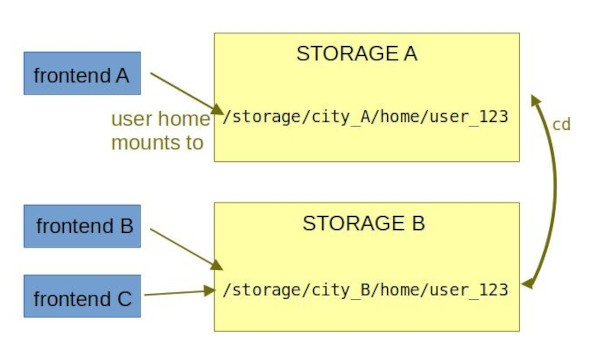

# Frontend-storage relationship

A **frontend** is a single machine intended for user logins and ligh pre- and post-processing of data.

A **storage** is a large disc array where user data (user home directories) are kept.

!!! note "Storage names"
    Storages are named according to their physical location (city) + number.

As there is not one huge storage, but several large and loosely interconnected storages, users have access to **several different home directories**.

Every frontend has a `/home` directory mounted to one of the storages, e.g. `/home` of frontend `skirit.metacentrum.cz` is mounted on `/storage/brno2/home`, so when an user is logged on `skirit`, the commands `ls ~` and `ls /storage/brno2/home/user123` are equivalent. 

A frontend has a native home directory on one, and only one, storage; however this is not true the other way round: a home directory on a certain storage may be mounted by more than one frontend:

    user123@user123-XPS-13-9370:~$ ssh nympha.zcu.cz 
    ...
    (BULLSEYE)user123@nympha:~$ pwd
    /storage/plzen1/home/user123   # "plzen1" is native storage for "nympha" frontend
    (BULLSEYE)user123@nympha:~$ exit 
    user123@user123-XPS-13-9370:~$ ssh minos.zcu.cz
    ...
    (BULLSEYE)user123@minos:~$ pwd
    /storage/plzen1/home/user123   # "plzen1" is native storage also for "minos" frontend

The overall schema can be summed up as shown below:

**Transition between storages is possible** no matter which frontend an user is logged to. To get to a certain home directory, user does not need to log on a specific frontend. Users can change their home directories by `cd` command.

For example, assume that `skirit.metacentrum.cz` frontend is down and you want to access `brno2` storage:

    user123@user123-XPS-13-9370:~$ ssh tarkil.metacentrum.cz # login to "tarkil" instead
    ...
    (BULLSEYE)user123@tarkil:~$ pwd
    /storage/praha1/home/user123   # I am on "praha1" storage, but need "brno2"
    (BULLSEYE)user123@tarkil:~$ cd /storage/brno2/home/user123 # change to home on "brno2" storage
    (BULLSEYE)user123@tarkil:/storage/brno2/home/user123$ pwd 
    /storage/brno2/home/user123 # I am now on "brno2" storage 

