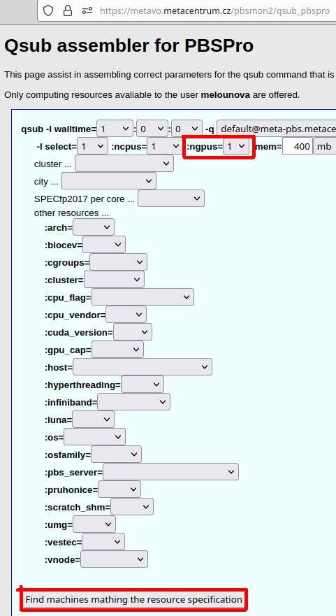

# Qsub assembler

**[Qsub assembler](https://metavo.metacentrum.cz/pbsmon2/qsub_pbspro)** is an online tool to setup syntactically correct `qsub` commands with PBS parameters.

Apart from obtaining the command, users can see which machines match to their selection criteria and how busy the nodes are at the moment.

**Example: I want to setup `qsub` command for 1-GPU job.**

*Use the rolldown menu to select the required parameters:*

*You will get qsub command parameters in both formats:*

*Additionally you can see the list of machines that comply to the criteria:*

