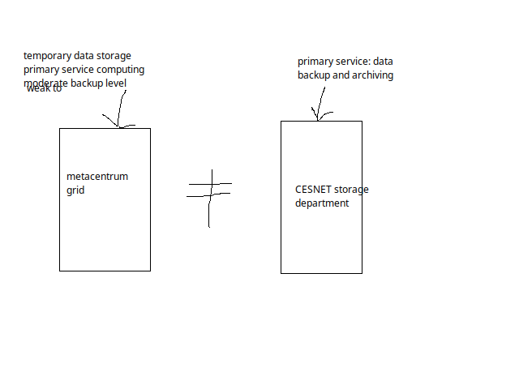
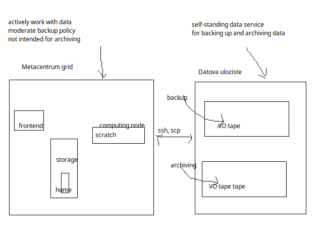

# Backup and archiving

**MetaCentrum** is a service intended to provide computing capacity to its users. MetaCentrum *has* a reasonably large storage space and a backup policies of it's own, so the users' data are far from being unprotected.

However, if you look for serious backup and archiving space, users should opt for **[CESNET Storage Department service](https://du.cesnet.cz/en/start)**. Like MetaCentrum, this is a service provided by CESNET.

The CESNET Storage Department service is available to all user with **MetaCentrum login and password**.

MetaCentrum backup policy will be described to detail in this chapter.

Cesnet storage department policies will be described to a certain level, too. However for more detailed information, users should refer to [Storage department documentation pages](https://du.cesnet.cz/en/start).

## MetaCentrum data policy 

There are two data storage types offered by MetaCentrum **with respect to backup policy**:

| Storage type 	 | Basic description | Typical usecase| 
|----------------|-------------------|----------------|
| Scratch storages | Fast storages on computing nodes | Storing data **during** a computation |
| Disk arrays | `/storage` volumes, user homes | Storing data **between** computations |

### Scratch storages

- Scratch storages (scratch directories) on computational nodes serve to store the temporary files. 
- They are **not backed-up** in any way.
- After the job ends, data on scratch storages are automatically deleted after 14 days (if not cleared by the batch script).

### Disk arrays

- Disk arrays are meant to prepare, process and store data between jobs.
- Disk arrays are several connected hard drives accessible via `/storage` directories.
- Files are **stored on multiple drives**, which guarantees higher I/O data speed and reliability.
- Disk arrays have a **backup policy of saving snapshots** (once a day, usually at night/early morning) of user's data.
- The snapshots are **kept at least 14 days** backwards.

The backup policy on storages offers some protection in case **user unintentionally deletes some of their files**; Generally, data that existed the day before the accident can be recovered. 

The snapshots are stored, however, on the same disk arrays as the data, so **in case of hardware failure these backups will be lost**. 

## Storage Department data policy

!!! info "Data archiving and backup is not MetaCentrum service"
    From within MetaCentrum frontend, users can **ssh**/**scp** to Storage Department infrastructure. Information in this section is a rough overview of data services provided by Cesnet Storage Department. In case of problems/questions, we recommend to [contact Cesnet Storage Department](https://du.cesnet.cz/en/o_nas/start).

Underlying infrastructure in Storage Department are **servers with hierarchical storage policy**. To increase redundancy of data, these discs contain several layers of storage media: first layer is a disk array, lower layers are made of MAIDs (Massive Array of Idle Drives) or magnetic tape libraries.

- Lower layers have bigger capacity but slower access times.
- Data are moved automatically among these layers based on their last usage.
- The most important consequence from the user's point of view is that the access to unused data may be slower than to the recently used ones.

**Current Storage Department servers**

| Server name | Mounted at | Note |
|-------------|------------|-------|
| storage-du-cesnet.metacentrum.cz | /storage/du-cesnet/ | for all Metacentrum users |
| storage-brno14.ceitec.metacentrum.cz | /storage/brno14-ceitec/ | for NCBR/CEITEC users only |

!!! warning
    Never leave data directly in the home, i.e. in` /storage/du-cesnet/home/META_username/`. The home directory should serve only to keep SSH keys, making links to directories with the actual data and other configuration files. To enforce this, there is tiny quota set on home directory (see further [info on Cesnet data storage service pages](https://du.cesnet.cz/en/navody/home-migrace-plzen/start)).

### Backup

- `/storage/du-cesnet/home/META_username/VO_metacentrum-tape_tape/`
- Use this option to backup data to protect data in case primary data are lost.
- Typically these data need not to be kept for a very long time.
- Files older than 12 months are automatically removed (they are considered as "expired").

### Archiving

- `/storage/du-cesnet/home/META_username/VO_metacentrum-tape_tape-archive/`
- Use this option to archive data you want to keep "forever".
- The directory has user quota set for volume of data and/or number of files.
- The data are not removed after a time (they do not "expire").

