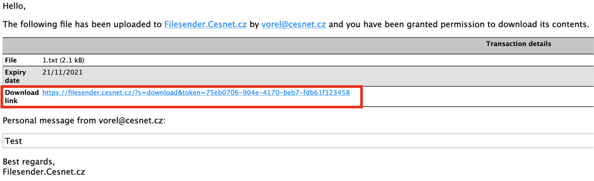

# Data outside MetaCentrum

- jak sdilet data s nekym mimo Metacentrum
- posilani velkych dat

### Send data outside MetaCentrum

In case you need to pass large amount of data to someone without Metacentrum access, we recommend to use Cesnet Filesender upload. On this page we describe the CLI version, which can be used directly from Metacentrum frontends.

#### Get Filesender config file

If you use filesender for the first time, you have to get the configuration file first. If you already have a configuration file, skip this step and go directly to the next chapter.

**Log on Cesnet Filesender homepage**

Use your Metacentrum username and password to login to [Cesnet Filesender homepage](https://filesender.cesnet.cz/).

**Upload some dummy file to initialize the database**

There is a small bug causing that the GUI does not display entry for users with no upload history. To overcome this, upload and send (to yourself) any dummy file by drag-and-drop first.

**Download configuration file from Cesnet Filesender**

On main page, choose My Profile --> click on the link Download Python CLI client configuration.

Then,

The configuration file is a normal text file. Nothing needs to be modified or added to this file, just save it somewhere on your frontend.

#### Upload files to Filesender

To make filesender run, add it as a module:

    module add filesender-cli

and export a path to the configuration file:

    export FILESENDER_CONFIG=/storage/.../path-to-configuration-file # default configuration is in $HOME/.filesender/filesender.py.ini

Then you can upload the file:

    filesender.py -s "Subject" -r recipient_1@example.org    file.tar.gz     # upload file.tar.gz

#### Download files from Filesender

Once you have received an email with a notification that some file has been uploaded to Filesender.Cesnet.cz and you have been granted permission to download its contents, click on the Download link.

A new window in your browser will be open where you have to copy a URL hidden under the Download button.

Go to the terminal and use wget utility to download the file. The syntax looks like:

    wget -O "file_name" "URL"

Replace file\_name with name as you wish and URL by saved URL in your clipboard. Do not forget to use double quotes.

 

