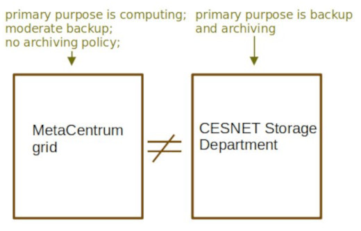

# Metacentrum backup policy

**MetaCentrum** is a service intended to provide computing capacity to its users. MetaCentrum *has* a reasonably large storage space and a backup policies of it's own, so the users' data are far from being unprotected. MetaCentrum backup policy will be described to detail in this chapter.

However, if you look for serious backup and archiving space, users should opt for **[CESNET Storage Department service](https://du.cesnet.cz/en/start)**. Like MetaCentrum, this is a service provided by CESNET.

## MetaCentrum scratch vs storage

There are two data storage types offered by MetaCentrum **with respect to backup policy**:

| Storage type 	 | Basic description | Typical usecase| 
|----------------|-------------------|----------------|
| Scratch storages | Fast storages on computing nodes | Storing data **during** a computation |
| Disk arrays | `/storage` volumes, user homes | Storing data **between** computations |

## Scratch

- Scratch storages (scratch directories) on computational nodes serve to store the temporary files. 
- They are **not backed-up** in any way.
- After the job ends, data on scratch storages are automatically deleted after 14 days (if not cleared by the batch script).

## Storages (disk arrays)

- Disk arrays are meant to prepare, process and store data between jobs.
- Disk arrays are several connected hard drives accessible via `/storage` directories.
- Files are **stored on multiple drives**, which guarantees higher I/O data speed and reliability.
- Disk arrays have a **backup policy of saving snapshots** (once a day, usually at night/early morning) of user's data.
- The snapshots are **kept at least 14 days** backwards.

The backup policy on storages offers some protection in case **user unintentionally deletes some of their files**; Generally, data that existed the day before the accident can be recovered. 

The snapshots are stored, however, on the same disk arrays as the data, so **in case of hardware failure these backups will be lost**. 

For more information see [table of current storages](../../computing/storages).

