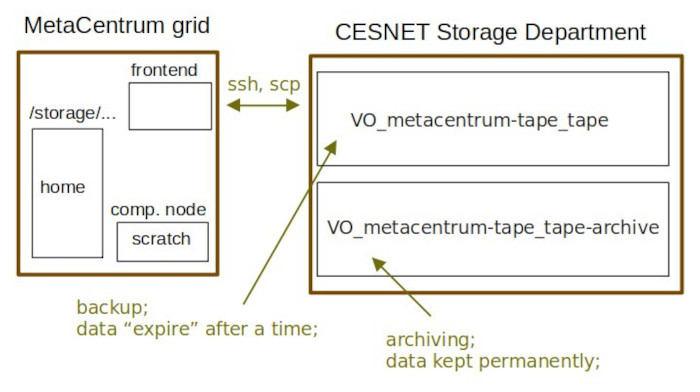

# Storage Department services

The CESNET Storage Department provides a backup and archiving service. It is available to all users with **MetaCentrum login and password**.

Storage Department data policies will be described to a certain level at this page. For more detailed information, users should however navigate the [Storage Department documentation pages](https://du.cesnet.cz/en/start).

<!--
## Tape storage

!!! info "Data archiving and backup is not MetaCentrum service"
    From within MetaCentrum frontend, users can **ssh**/**scp** to Storage Department infrastructure. Information in this section is a rough overview of data services provided by Cesnet Storage Department. In case of problems/questions, we recommend to [contact Cesnet Storage Department](https://du.cesnet.cz/en/o_nas/start).



Underlying infrastructure in Storage Department are **servers with hierarchical storage policy**. To increase redundancy of data, these discs contain several layers of storage media: first layer is a disk array, lower layers are made of MAIDs (Massive Array of Idle Drives) or magnetic tape libraries.

- Lower layers have bigger capacity but slower access times.
- Data are moved automatically among these layers based on their last usage.
- The most important consequence from the user's point of view is that the access to unused data may be slower than to the recently used ones.

**Current Storage Department servers**

| Server name | Mounted at | Note |
|-------------|------------|-------|
| storage-du-cesnet.metacentrum.cz | /storage/du-cesnet/ | for all Metacentrum users |
| storage-brno14.ceitec.metacentrum.cz | /storage/brno14-ceitec/ | for NCBR/CEITEC users only |

!!! warning
    Never leave data directly in the home, i.e. in` /storage/du-cesnet/home/META_username/`. The home directory should serve only to keep SSH keys, making links to directories with the actual data and other configuration files. To enforce this, there is tiny quota set on home directory (see further [info on Cesnet data storage service pages](https://du.cesnet.cz/en/navody/home-migrace-plzen/start)).

### Backup

- `/storage/du-cesnet/home/META_username/VO_metacentrum-tape_tape/`
- Use this option to backup data to protect data in case primary data are lost.
- Typically these data need not to be kept for a very long time.
- Files older than 12 months are automatically removed (they are considered as "expired").

### Archiving

- `/storage/du-cesnet/home/META_username/VO_metacentrum-tape_tape-archive/`
- Use this option to archive data you want to keep "forever".
- The directory has user quota set for volume of data and/or number of files.
- The data are not removed after a time (they do not "expire").
-->

!!! warning "Data storage technology in Storage department has changed by May 2024" 
    For a long time the data were stored on hierarchical storage machine ("hsm" for short) with a directory structure accessible from `/storage/du-cesnet`.<br/> Due to [end-of-life state and multiple hardware failures](https://du.cesnet.cz/en/novinky/start#termination_of_access_to_the_du4_repository_in_ostrava_-_2352024) the HSM storages were disconnected. User data have been transferred to [machines with Object storage technology](https://du.cesnet.cz/en/navody/object_storage/start).<br/> Object storage is successor of HSM with slightly different set of commands, i.e. it **does not** work in the precisely same way (sadly).

!!! tip "Ask <du-support@cesnet.cz> for help, they are prepared for many questions from users"
    Object storage is a different paradigm than good old Linux filesystem, so yes, this is a big change for most of our users and not a very easy one to grasp. The people in Storage department know this and they are prepared to answer your questions.<br/> Please be aware that MetaCentrum user support (<meta@cesnet.cz>) can provide only limited advice as the data storage is out of the scope of MetaCentrum services.

Below you will find short description of main object storage (S3) command and usage.

## Object storage

### Access

First you need to contact data storage support <du-support@cesnet.cz> and request them to obtain s3 credenials.

To work with S3 storage, you need to obtain S3 credentials `aws_access_key_id` (aka "access key") and `aws_secret_access_key` (aka "secret key") from Storage Department admins.

### Clients

There are more clients to work with s3 storages - see [guide on Storage Department pages](https://du.cesnet.cz/en/navody/object_storage/cesnet_s3/start).

#### s3cmd 

Create a configuration file `/storage/brno2/home/user123/.s3cfg`:

```
[default]
host_base = https://s3.cl4.du.cesnet.cz
use_https = True
access_key = XXXXXXXXXXXXXXXXXXXX  
secret_key = XXXXXXXXXXXXXXXXXXXXXXXXXXXXXXXXXXXXXXXX
host_bucket = s3.cl4.du.cesnet.cz
```

| Basic s3cmd commands||
|-----|-----|
| **Bucket operations** ||
| s3cmd ls | List all s3 buckets |
| s3cmd mb s3://newbucket | Create of new s3 bucket |
| s3cmd rb s3://newbucket | Remove s3 bucket |
| s3cmd du s3://newbucket/ | List s3 bucket size |
| **Files and directories operations** ||
| s3cmd ls s3://newbucket/ | List content of s3 bucket |
| s3cmd put file.txt s3://newbucket/ | Upload a file |
| s3cmd put -r directory s3://newbucket/ | Upload directory |
| s3cmd get s3://newbucket/file.txt | Download file from s3 bucket |
| s3cmd del s3://newbucket/file.txt<br/> $ s3cmd del s3://newbucket/directory | Delete data from s3 bucket |
| s3cmd sync /local/path/ s3://newbucket/backup/ | Data sync into s3 bucket |
| s3cmd sync s3://newbucket/backup/ ~/restore/ | Data sync from s3 bucket |


<!--
Examples:

```
#define CREDDIR, where you stored your S3 credentials for, default is your home directory
#S3CRED=/storage/brno2/home/<your-login-name>/.s3cfg

#stage in command for s5cmd
s5cmd --credentials-file "${S3CRED}" --profile profile-name --endpoint-url=https://s3.clX.du.cesnet.cz cp s3://my-bucket/h2o.com ${DATADIR}/

#stage out command for s5cmd
s5cmd --credentials-file "${S3CRED}" --profile profile-name --endpoint-url=https://s3.clX.du.cesnet.cz cp ${DATADIR}/h2o.out s3://my-bucket/
```
-->

#### aws 


Create a configuration file `/storage/brno2/home/user123/.aws/credentials`:

```
###
[my-profile]
aws_access_key_id = XXXXXXXXXXXXXXXXXXXX
aws_secret_access_key = XXXXXXXXXXXXXXXXXXXXXXXXXXXXXXXXXXXXXXXX
max_concurrent_requests = 200
max_queue_size = 20000
multipart_threshold = 128MB
multipart_chunksize = 32MB
###
```

| Basic aws commands||
|-----|-----|
| **Bucket operations** ||
| aws s3 --profile my-profile --endpoint-url https://s3.cl4.du.cesnet.cz ls | List all s3 buckets |
| aws s3 --profile my-profile --endpoint-url https://s3.cl4.du.cesnet.cz mb s3://test1 | Create of new s3 bucket |
| aws s3  --profile my-profile --endpoint-url https://s3.cl2.du.cesnet.cz rb s3://test1 | Remove s3 bucket |
| **Files and directories operations** ||
| aws s3 --profile my-profile --endpoint-url https://s3.cl2.du.cesnet.cz cp C:/Users/User/Desktop/test-file.zip s3://test1 | Upload a file |
| $ aws s3 --profile my-profile --endpoint-url https://s3.cl2.du.cesnet.cz cp s3://test1/test-file.zip C:\Users\User\Downloads\ | Download file from s3 bucket |
| $ aws s3 --profile my-profile --endpoint-url https://s3.cl2.du.cesnet.cz rm s3://test1/test-file.zip  | Delete data from s3 bucket |


<!--
Examples:


```
S3CRED=/storage/brno2/home/melounova/.aws/credentials
```
-->

<!--
#### rclone

Alternatively, you can use rclone tool, which is less handy for large data sets. In case of large data sets (tens of terabytes) please use s5cmd.
For rclone you need to create a credentials file (copy the content below) in your home dir, ie. `/storage/brno2/home/<your-login-name>/.config/rclone/rclone.conf`.

```
###
[profile-name]
type = s3
provider = Ceph
access_key_id = XXXXXXXXXXXXXXXXXXX
secret_access_key = XXXXXXXXXXXXXXXXXXXXXXXX
endpoint = s3.clX.du.cesnet.cz
acl = private
###
```


```
#define CREDDIR, where you stored your S3 credentials for, default is your home directory
#rclone example
#S3CRED=/storage/brno2/home/<your-login-name>/.config/rclone/rclone.conf
```

```
#stage in command for rclone
rclone sync --progress --fast-list --config ${S3CRED} profile-name:my-bucket/h2o.com  ${DATADIR}
```

```
#stage in command for rclone
rclone sync --progress --fast-list --config ${S3CRED} ${DATADIR}/h2o.out profile-name:my-bucket/  
```
-->

<!--
- describe the process [in RT ticket](https://rt.cesnet.cz/rt/Ticket/Display.html?id=1245495)
-->
