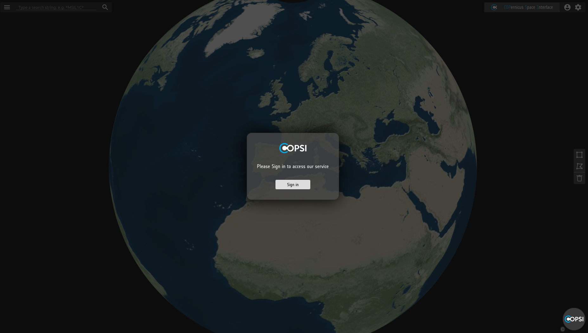
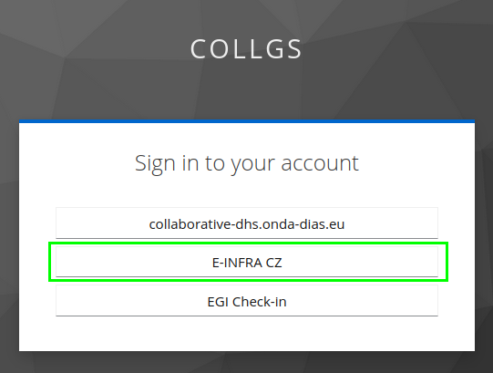
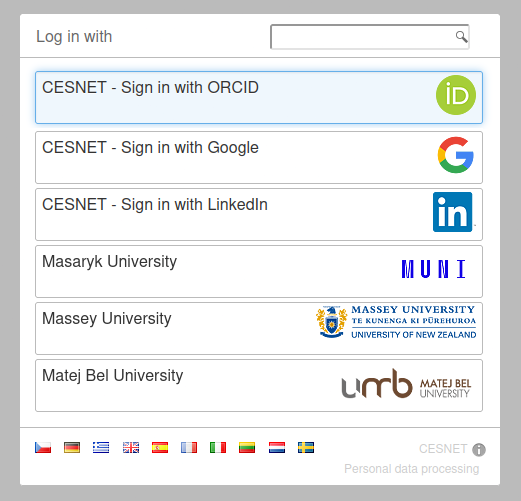
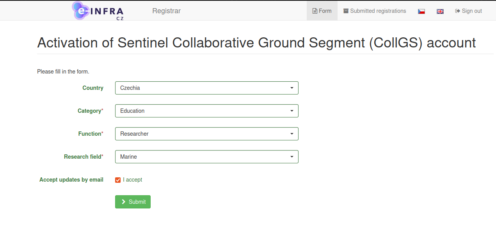
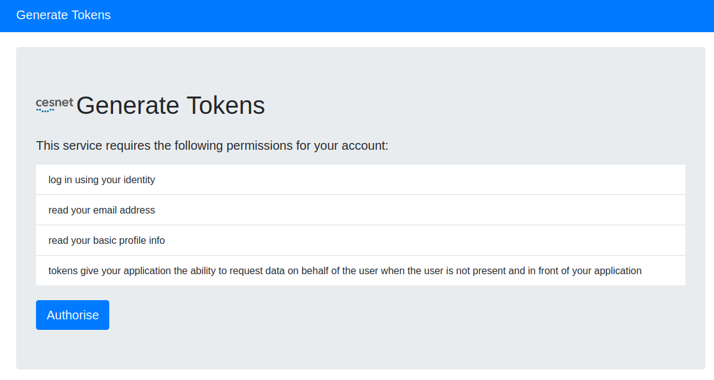
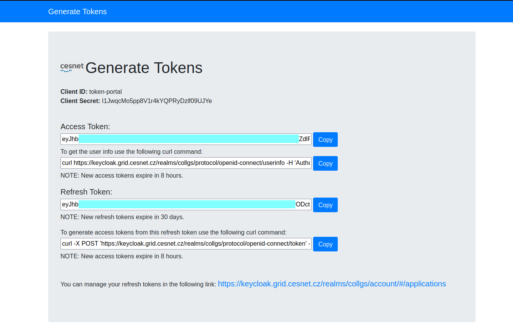
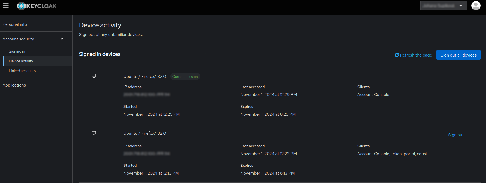

# Autentizace uživatelů v GSS
Tato sekce popisuje autentizaci uživatelů v systému GSS (Gael Store Service), a to jak interaktivní
přihlášení v grafické komponentě COPSI, tak získání a výměnu tokenů pro strojové použití. Oba způsoby vyžadují registraci.
Návod na použití tohoto software naleznete v sekci o [práci s daty družic Sentinel](./sentinel.md).

## Grafické rozhraní



Při přístupu k aplikaci COPSI na adrese [https://collgs.cesnet.cz](https://collgs.cesnet.cz) se zobrazí okno vyžadující přihlášení.
Po potvrzení tlačítkem _Sign In_ budete přesměrováni na výběr komunity, kterou se chcete přihlásit.



Zde zvolte variantu _E-INFRA CZ_. V budoucnu bude systém rovněž podporovat variantu přihlášení přes _EGI Check-In_.
Ve výběru vyberte Vaši přidruženou instituci, nebo sociální identitu (např. ORCID).




Dokončete přihlášení. Pokud se přihlašujete poprvé, budete přesměrováni na registrační formulář.
V něm vyplňte požadované údaje. Odesláním vyplněné přihlášky se zakládá účet v IAM systému Perun.
Ten je aktivní po dobu dvou let, před expirací účtu obdržíte emailem upozornění na prodloužení platnosti účtu. 



Následně budete přesměrováni zpět do aplikace Copsi.

## Strojový přístup

Pro stažení produktů pomocí OData API je nutné k požadavkům přidat autentizaci formou access tokenu.
Tokeny lze získat na adrese [https://keycloak.grid.cesnet.cz/token-portal](https://keycloak.grid.cesnet.cz/token-portal).



Na stránce portálu pokračujte přes volbu _Authorise_. Pokud tokeny generujete poprvé, bude nutné provést registraci. V opačném
případě se přihlaste, podobně jako v případě přístupu přes [Grafické rozhraní](#grafické-rozhraní).



Na stránce _Generate Tokens_ jsou následující položky:

**Access Token** - slouží k autentizaci a autorizaci při přístupu k API. Má platnost 8 hodin.

**Refresh Token** - slouží k obnovení access tokenu bez nutnosti opakovaného přihlášení. Platí 30 dnů. Při každé
žádosti o výměnu access tokenu se vydá zároveň nový refresh token. Původní refresh token se
tím stává nevalidním, a pro příští výměnu tokenů je nutné použít nový refresh token. Nový refresh token bude mít platnost 30 dnů.

**Client ID a Client Secret** - slouží pro autentizaci aplikace při výměně tokenů.

**Příkaz pro výměnu tokenů** - tímto příkazem při expiraci access tokenu získáte nový access token a refresh token s plnou platností.

**Odkaz na správu tokenů** - vede na aplikaci ke správě účtu a tokenů. Zde se můžete odhlásit ze zařízení a revokovat
tak refresh token.

### Jak pracovat s tokeny
#### 1. Přístup k API s Access Tokenem
Po získání access tokenu ho přípojíte k požadavkům na API jako autorizační hlavičku:

    Authorization: Bearer <access_token>

Přidání této hlavičky k požadavkům umožní API ověřit vaši identitu a získat potřebná oprávnění.
Volání GSS OData API pak může vypadat následovně:
```shell
curl -X GET "https://collgs.cesnet.cz/odata/v1/Products?\$filter=startswith(Name,'S1')%20and%20contains(Name,'SLC')" \
-H "Authorization: Bearer $ACCESS_TOKEN"  \
-H "Accept: application/json"
```

#### 2. Obnovení access tokenu pomocí refresh tokenu
Jakmile access token vyprší, místo opětovného přihlášení můžete využít refresh token k získání nového access tokenu.
Proces probíhá zasláním POST požadavku, který je předpřipravený jako _curl_ dotaz
na stránce Token portálu. Tento požadavek využívá volání Pythonu, pokud využíváte Python verzi 3, nahraďte v příkazu
_python_ za _python3_. Tento požadavek Vám spolu s dalšími informacemi vydá nový access token, který má platnost 8 hodin,
a refresh token s platností 30 dní.
Ve formátu JSON bude odpověď vypadat následovně:

    {
    "access_token": "eyJh....gywQ",
    "expires_in": 300,
    "refresh_expires_in": 28800,
    "refresh_token": "eyJh....xjVg",
    "token_type": "Bearer",
    "id_token": "eyJh....zLMA",
    "not-before-policy": 0,
    "session_state": "80....ff",
    "scope": "openid email profile"
    }

Nový access token lze dále využívat pro dotazy v GSS, novým refresh tokenem nahraďte ten starý.

#### 3. Bezpečné ukládání tokenů
**Access token**: Ukládejte v paměti (např. v proměnné nebo cache) pouze po dobu, kdy je aktivní. Jelikož má kratší platnost,
není potřeba jej dlouhodobě uchovávat.

**Refresh token**: Doporučuje se ukládat do bezpečného úložiště, např. do databáze nebo do šifrovaného úložiště.
Refresh token má delší platnost, a proto by měl být uložen na bezpečném místě s omezeným přístupem.

#### 4. Revokování tokenů
V případě potřeby lze tokeny revokovat pomocí aplikace na správu účtů, která je odkazována 
ve spodní části Token portálu. Odhlášení (revokace tokenu) se nachází v části Account security > Device activity.
Volbou _Sign out_ se odhlásí vybrané zařízení, volba _Sign out all devices_ slouží pro hromadné odhlášení.



### Výměna tokenů
V případě, že již pracujete s tokeny z EGI Check-inu, je možné je bez nutnosti dalšího přihlášení vyměnit
za tokeny umožňující přístup do systému GSS. V takovém případě odešlete platný access token vydaný EGI Check-inem
metodou POST na endpoint [https://keycloak.grid.cesnet.cz/realms/dhus/protocol/openid-connect/token](https://keycloak.grid.cesnet.cz/realms/dhus/protocol/openid-connect/token) a do těla požadavku
připojíte následující:

    {
    "client_id": "token-exchange",
    "grant_type": "urn:ietf:params:oauth:grant-type:token-exchange",
    "subject_token": {EGI access token},
    "subject_issuer": "https://aai.egi.eu/auth/realms/egi"
    }

V odpovědi získáte access token, který lze použít pro volání API GSS.