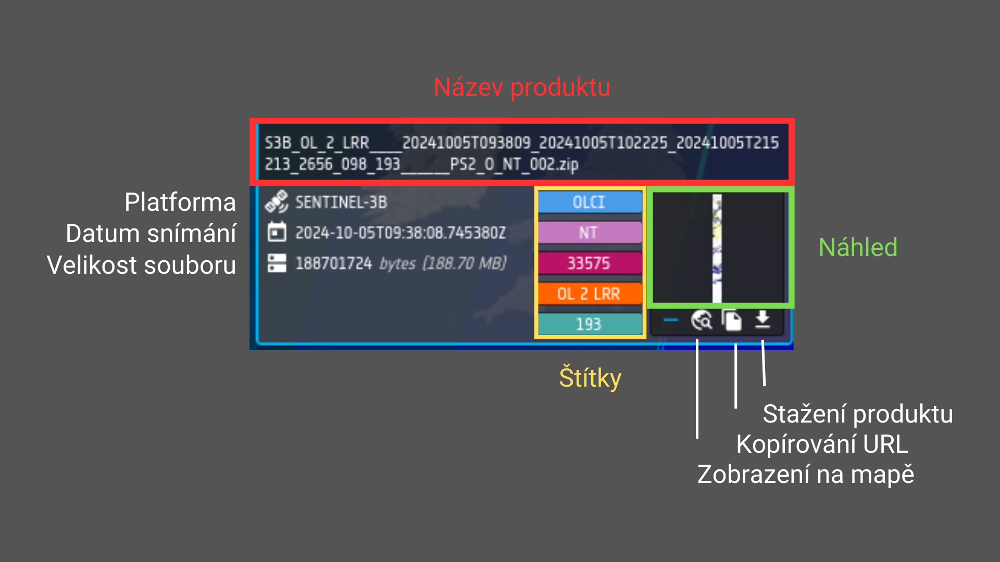
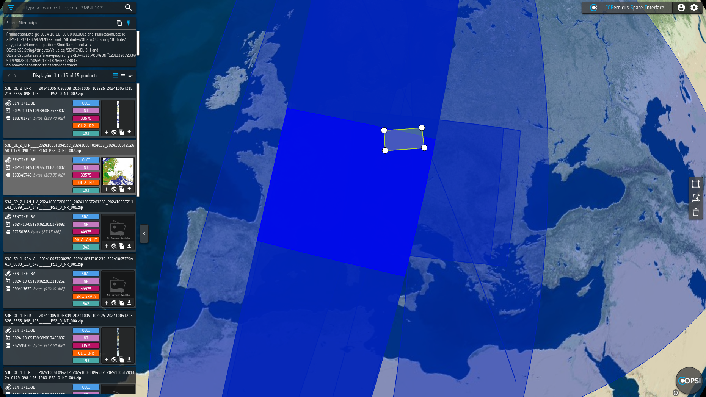

# Přístup k datům

Národní uzel umožňuje přístup k datům misí Sentinel všemi běžnými způsoby. V současnosti se na něm neuplatňují žádná rychlostní ani kapacitní omezení.
Předchozí verzi softwaru zpřístupňujícího data z družic Sentinel, Sentinel DataHub System, který je stále dostupný na 
adrese [https://dhr1.cesnet.cz](https://dhr1.cesnet.cz/), nahrazuje nový software GSS (Gael Store Service). V první polovině roku 2025 budou oba systémy přístupné současně,
GSS jej dále plně nahradí. Jednou ze změn týkajících se přechodu na nový systém je například zrušení možnosti přihlášení
do grafického rozhraní pomocí jména a hesla nebo zavedení tokenů pro komunikaci s API pro strojový přístup.

## Grafické uživatelské rozhraní

Grafické uživatelské rozhraní je přístupné díky aplikaci COPSI (COPernicus Space Interface), která je přístupná na adrese [https://collgs.cesnet.cz/](https://collgs.cesnet.cz/). 
Před prvním použitím je nutná registrace, a to i v případě, že jste již byli registrováni v předchozí verzi systému (Sentinel DataHub System).
Podrobný návod k registraci a přihlášení naleznete v návodu [Autentizace uživatelů v GSS](./gss_login/).
Detailní návod pro COPSI v anglickém jazyce naleznete v [příručce pro uživatele](https://collgs.esa.int/wp-content/uploads/2024/06/ALIA-COPSI-ICM-22-0001_Installation_and_Configuration_Manual_3.0.0.pdf).


Změnu projekce mapy, zobrazování geografických názvů a terénu lze změnit v nastavení v pravém horním rohu.


### Vyhledávání a filtrování
#### **Základní vyhledávání**
Vyhledávací lišta, umístěná v levém horním rohu stránky, umožňuje zadávat jednoduché textové dotazy. Nabízí také možnost pokročilého vyhledávání s různými filtry, které jsou dostupné ve vyhrazené sekci.

Katalog je založen na protokolu OData, nepodporuje plnotextové vyhledávání, takže uživatelé musí zadávat filtr pomocí 
správné syntaxe OData `$filter`. Uživatelé však mohou přidat zástupný znak `*` k textovému řetězci jako zjednodušenou 
formu dotazu podle názvu produktu:

`<Text>*` bude v požadavku nahrazen výrazem `startswith(Name, '<Text>')`, tedy název produktu má **začínat** řetězcem.

`*<Text>*` bude nahrazen výrazem `contains(Name, '<Text>')` - produkt má **obsahovat** řetězec.

`<Text>*` bude nahrazen výrazem `_endswith(Name, '<Text>')` - produkt má **končit** řetězcem.

Tímto způsobem lze použít hvězdičku pro flexibilnější vyhledávání dle názvu produktu. Například přidání textu `*S3B_OL*` do vyhledávací lišty spustí dotaz
`odata/v1/Products?$filter=contains(Name, 'S3B_OL')`.

#### Pokročilé vyhledávání
Sekci pokročilého vyhledávání lze zobrazit kliknutím na ikonu nalevo od vyhledávací lišty. Jakmile je seznam produktů načten, zobrazí se pod vyhledávací 
lištou. Lze zde filtrovat produkty podle mise, data pořízení, apod. Výsledný filtr použitý pro dotaz je zobrazen pod vyhledávací lištou,
odkud je možné jej vykopírovat pro případné strojové zpracování.


#### Geografické vyhledávání
Panel geografického vyhledávání je umístěný na obrazovce vpravo uprostřed. S jeho pomocí lze provádět geografické vyhledávání 
na základě polygonálních oblastí, které se kreslí přímo na mapu.

Stejné funkce tohoto panelu jsou dostupné také v kontextové nabídce, kterou lze otevřít kliknutím pravým tlačítkem kamkoli na mapě.


### Prohlížení produktů

Výsledky vyhledávání se zobrazují pod vyhledávací lištou.



Každý produkt v seznamu je zobrazen v rámečku, přičemž název produktu je uveden nahoře v záhlaví.
Vlevo v rámečku se nacházejí hlavní informace o produktu, jako je název platformy, datum snímání a velikost souboru.
Vpravo je náhled produktového snímku, pokud je k dispozici. Pod náhledem se nachází oblast s akčními tlačítky pro kopírování URL a stažení produktu.




Při najetí myší na obrysy na mapě se zvýrazní všechny obrysy, nad kterými se nachází kurzor myši, a současně se zvýrazní i odpovídající produkty v seznamu.
Při najetí myší na rámeček produktu ve výsledku vyhledávání se zvýrazní daný obrys na mapě.

## Strojový přístup

Národní uzel CollGS podporuje strojový přístup protokolem *OData*. Strojový přístup je vhodný pro automatické nástroje i pro dávkové stažení většího množství dat.
Dotazovací rozhraní je přístupné na adrese: [https://collgs.cesnet.cz/odata/v1](https://collgs.cesnet.cz/odata/v1).

Pro psaní jednoduchých skriptů se hodí především nástroje `curl` nebo `wget`. Pro autentizaci při stahování produktu již není možné využít jméno a heslo,
ale je nutné použít OIDC tokeny, které se generují na adrese token portálu: [https://keycloak.grid.cesnet.cz/token-portal](https://keycloak.grid.cesnet.cz/token-portal).
Podrobnější popis autentizace naleznete v návodu [Autentizace uživatelů v GSS](./gss_login/).

### Vyhledání produktu

Následující příklady shrnují způsob skládání URL adresy pro vyhledávání produktův OData API.
Podrobný návod je k dispozici v anglickém dokumentu [GSS Administration Manual](https://collgs.esa.int/wp-content/uploads/2024/07/GAEL-P311-GSS%20-%20Collaborative%20Data%20Hub%20Software%20GSS%20Administration%20Manual_1.6.5.pdf#page=77) - kapitola 10.
Alternativou je použití [STAC katalogu metadat](#stac-katalog-metadat).

Pro použití pomocí nástroje curl je nutné správně zakódovat speciální znaky v URL jako mezery a uvozovky.
Následující příkazy shrnují základní použití OData API s access tokenem uloženým v proměnné `ACCESS_TOKEN`.

K vylistování všech produktů:

```shell
curl "https://collgs.cesnet.cz/odata/v1/Products" \
-H "Authorization: Bearer $ACCESS_TOKEN"
```

Vyhledání produktu podle UUID (např. *4125df3d-468c-4c3f-b283-249874447a18*):

```shell
curl "https://collgs.cesnet.cz/odata/v1/Products(4125df3d-468c-4c3f-b283-249874447a18)" \
-H "Authorization: Bearer $ACCESS_TOKEN"
```

Příklady filtrování a kódování speciálních znaků v _curl_:

|                                         | Filtr                                                                                                                                             | Volání CURL                                                                                                                                                                                                                                                                  |
|-----------------------------------------|---------------------------------------------------------------------------------------------------------------------------------------------------|------------------------------------------------------------------------------------------------------------------------------------------------------------------------------------------------------------------------------------------------------------------------------|
| Vyhledání podle mise (např. `SENTINEL-1`) | `$filter=(Attributes/OData.CSC.StringAttribute/any(att:att/Name eq 'platformShortName' and att/OData.CSC.StringAttribute/Value eq 'SENTINEL-1'))` | `curl 'https://collgs.cesnet.cz/odata/v1/Products?$filter=(Attributes%2FOData.CSC.StringAttribute%2Fany(att%3Aatt%2FName%20eq%20%27platformShortName%27%20and%20att%2FOData.CSC.StringAttribute%2FValue%20eq%20%27SENTINEL-1%27))' -H "Authorization: Bearer $ACCESS_TOKEN"` |                                                                                                                                                                                                                                                                              |
| Vyhledání podle data zveřejnění (např. od `15.3.2024` do `16.3.2024`) | `$filter=(PublicationDate ge 2024-03-15T00:00:00.000Z and PublicationDate le 2024-03-16T23:59:59.999Z)`                                           | `curl "https://collgs.cesnet.cz/odata/v1/Products?$filter=(PublicationDate%20ge%202024-03-15T00:00:00.000Z%20and%20PublicationDate%20le%202024-03-16T23:59:59.999Z)" -H "Authorization: Bearer $ACCESS_TOKEN"`                                                               |
| Vyhledání podle části názvu (např. začíná na `S1` a obsahuje `SLC`) | `$filter=startswith(Name,’S1’)  and contains(Name,’SLC’)` | `curl 'https://collgs.cesnet.cz/odata/v1/Products?$filter=startswith(Name,%20%27S1%27)%20and%20contains(Name,%20%27SLC%27)' -H "Authorization: Bearer $ACCESS_TOKEN"`                                                                                                                                                                                                                                                                             |


### Stažení produktu

Pro stažení celého produktu:

    curl "https://collgs.cesnet.cz/odata/v1/Products(4125df3d-468c-4c3f-b283-249874447a18)/\$value"  \
    -H "Authorization: Bearer $ACCESS_TOKEN"  \
    -o produkt_odata.zip

Pro stažení pouze části (např. manifestu) je vhodné stáhnout pouze daný soubor, a to například takto:

    curl -v $'https://collgs.cesnet.cz/odata/v1/Products(4125df3d-468c-4c3f-b283-249874447a18)/Nodes(\'S3A_OL_1_EFR____20241008T122148_20241008T122448_20241009T125258_0179_117_380_1800_PS1_O_NT_004.SEN3\')/Nodes(\'xfdumanifest.xml\')/$value'  \
    -H "Authorization: Bearer $ACCESS_TOKEN"  \
    -o xfdumanifest.xml

## STAC katalog metadat

Pro získání metadat produktů ve formátu STAC je k dispozici katalog na adrese [https://stac.cesnet.cz](https://stac.cesnet.cz).
Dokumentaci katalogu naleznete v sekci [STAC](./stac.md).

## Podpora specifických aplikací

Máte-li speciální požadavky nebo potřebujete pomoci s navržením optimální metody přístupu k datům, kontaktujte nás na <collgs@cesnet.cz>.

Pro konkrétní účely lze dohodnout např.:

- pomoc při návrhu přístupového mechanizmu.
- automatické kopírování nových dat na koncový bod uživatele podle nastavených kritérií např. protokolem SCP.
- plnění vaší vlastní aplikace.

## Rozhraní ArcGIS

Ke snímkům z platformy Sentinel 2 lze interaktivně přistupovat též přes webové rozhraní [SW balíku ArcGIS](https://arcgis.cesnet.cz/apps/wabis/): 


## Kontakt

Dotazy i hlášení případných problémů směřujte na adresu <collgs@cesnetcz>.

Výpadky nebo plánované odstávky systému budeme oznamovat na [stránce výpadků Meta VO](https://metavo.metacentrum.cz/cs/news/outages.jsp). 

