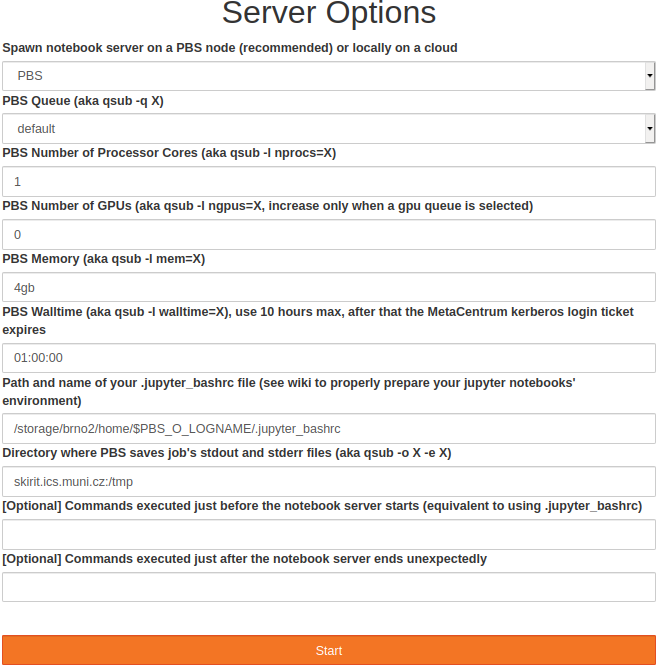
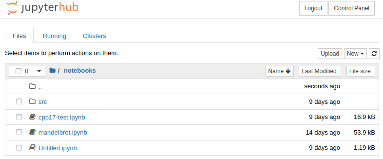
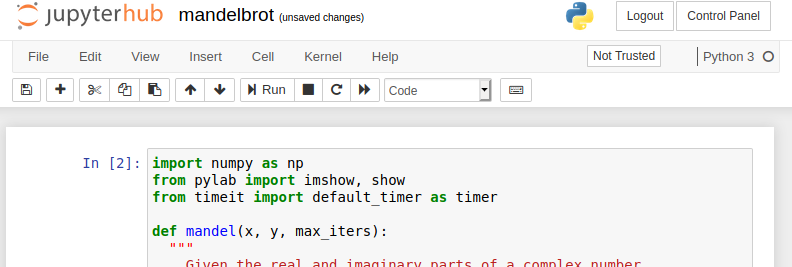
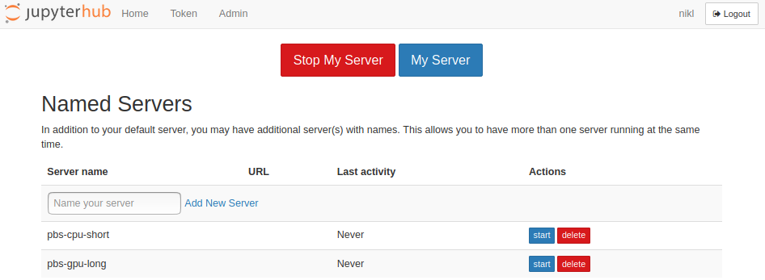
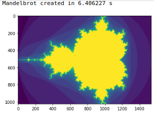
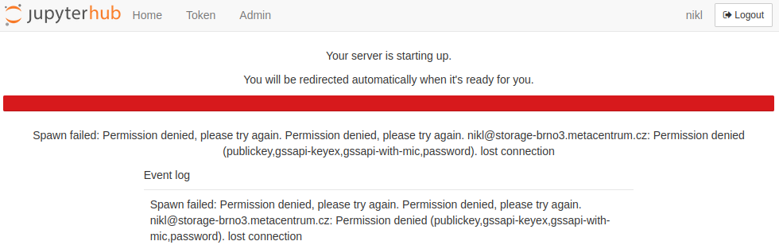

# Jupyter notebook

[Jupyter notebook](https://jupyter.org/) is a project to develop open-source software, open standards, and services for interactive computing across multiple programming languages.

This is tutorial for **[Metacentrum instance of Jupyter notebook](https://jupyter.cloud.metacentrum.cz)** servers on cloud.

For other approaches to Jupyter, see [Jupyter page (software)](/software/sw-list/jupyter).

## Overview

Metacentrum users have access to a local Jupyterhub webserver where they can run either preset or their own Jupyter notebook servers.

The Jupyter Notebook server is an open-source web application that allows you to create and share documents that contain live code, equations, visualizations and narrative text. Uses include: data cleaning and transformation, numerical simulation, statistical modeling, data visualization, machine learning, and much more.

The notebook servers can be spawn either on computational nodes of Metacentrum clusters or on OpenStack virtual nodes and the source code written by the user is saved in Jupyter notebook source files with the `.ipynb` suffix. These source files can contain not only the source code, but also descriptions, comments, images, plots and other elements to make it a complete scientific and educational tool for its users. 


## Login

Log in using your Metacentrum Kerberos credentials. Your **Kerberos ticket** (which grants you access to Metacentrum resources) **is usually valid for only 10 hours**.


!!! warning
    Jupyterhub does not warn you that your ticket has expired, so you may experience strange behaviour like PBS job errors or being unable to use your Jupyter notebooks or access your data. The solution is to log in again to generate a new valid ticket.

## Spawner options

After a successful login set the job profile for the PBS node your Jupyter notebook server will run on. 



You can use the default set of options and click Start, or you can individually set each option so that it is compatible with the qsub command and its parameter syntax. If you want to work on gpus, you need to select the `gpu_jupyter` queue and set the number of gpus to 1 or 2. 

This queue starts jobs only on the Adan cluster that has 2x Nvidia Tesla T4 cards, which offer the tensor cores for accelerated AIs. The last two parameters (prologue and epilogue commands) are optional, prologue works the same way as `.jupyter_bashrc`, entered commands are executed before the jupyter notebook server is started, and epilogue commands are executed if the notebook server ends unexpectedly (right now there is no limit to how long the notebook server runs, so every job is being killed by the PBS walltime watchdog, so don't be alarmed that all your jupyterhub PBS jobs end with a non-zero exit code).

Very rarely the spawning process can fail for some unknown reason (disappearing from the queue, being stuck on the loading page during the `Cluster job running... waiting to connect` state for more than roughly 5 minutes, etc.), in which case just repeat the process and create a new notebook. If you encounter persistent problem, contact the admins using the information on the bottom of this wiki page. 

## Spawning process

To setup your own personal environment on the target PBS node, define your own `.jupyter_bashrc` in your home directory `/storage/brno2/home/$USER` (in the near future you will be able to change this path, for now it is hard coded), which will be sourced at the start of each PBS job. Use this file to load modules, define environment variables, etc.

Example of `.jupyter_bashrc`:

```
module load cuda-10.1 cudnn-7.6.4-cuda10.1
export MY_DIR="/storage/praha1/home/$USER/myapp"
export PATH+=":$MY_DIR/bin"
```

After clicking on the Start button, the spawning process begins. The OpenStack cloud job profile spawns and opens the notebook server within seconds on the local virtual OpenStack cloud. 

The PBS job profiles submit a predefined job script under your username (as `sudo -E -u $USER qsub...`) and the stdout and stderr outputs of the job are also saved in your home directory `/storage/brno2/home/$USER` (in the near future you will be able to also set your preferred home directory) after the job finishes. You can check the PBS script below.

After the job gets successfully queued, which usually takes about 5-10 seconds, the Jupyterhub screen changes into a progress bar with the Pending in queue status. 

Now the job is waiting for free computational resources, which can take a few seconds or minutes, sometimes longer (the threshold is set to 1 hour, after that you need to submit a new job). The status can be checked using the `qstat -u $USER` (add the `-x` argument if the job seems to disappear due to switching to a moved (`M`) state) command on any PBS Metacentrum server.


Once the job starts, it takes about 30-60 seconds for the notebook server to initiate and establish connection with the hub. 


!!! warning
    There is a one hour (3600s) waiting threshold, after which jupyterhub deletes pbs job from the queue if it is still waiting for resources and the user has to start a new jupyter notebook again. The reasoning behind this is that most users are not willing to wait for more than a few tens of minutes to start their interactive session and the PBS job with the running jupyter notebook server would consume resources in the background. This 1h limit can be changed in the future, but if your job is waiting in a queue for more than an hour, it will get deleted and you need to start a new jupyter notebook. 

Once the notebook server establishes connection with the hub, the screen switches into your Jupyter notebook server running in the `NOTEBOOK_DIR` as a root location, which is predefined to `/storage/brno2/home/$USER`. You can redefine it by using the `.jupyter_bashrc` environment file. 



To start programming, open your Jupyter notebook source file (`notebooks/mandelbrot.ipynb` in this example) or create a new one by clicking on *New* and choosing a kernel. Right now the default notebook server has Python 3 and C++ kernels with CUDA support. 

It is also possible for the users to add additional kernels or bring their own notebook servers in the form of a docker image and admins will add the option for the users to choose their own notebook servers. In the near future users will be able to use their own notebook servers automatically. 



If you wish to stop or restart current notebook server, go to *Home* (or *Control Panel* if you already run an active notebook server), click on *Stop My Server* and *Start My Server*. 

!!! note
    It is possible to spawn multiple Jupyter notebook servers per user. Click on *Home* (or *Control Panel* if you are in an active notebook server) and create a new named server. The first notebook server can have no name and it is considered a feature by the Jupyterhub developers. 



!!! warning
    On OpenStack cloud notebook servers run indefinitely. But once the job finishes on PBS, you will see a connection fail message. This is because the current PBS spawner does not have the option to close the notebook server properly before the walltime is reached and inform the hub. It will be fixed in the near future, we also plan to add a walltime countdown for each notebook server. 


Besides the error message, you can also notice that the kernel becomes unavailable. This also signals that the connection between the hub and your notebook server has been lost. 


## Examples

We provide a few examples to show you how to use and test the Jupyter notebook environment. 

### Python

Mandelbrot set running on CPU (complete notebook source file available at [github - numba examples](https://github.com/harrism/numba_examples) 

```
import numpy as np
 from pylab import imshow, show
 from timeit import default_timer as timer
 
 def mandel(x, y, max_iters):
   """
     Given the real and imaginary parts of a complex number,
     determine if it is a candidate for membership in the Mandelbrot
     set given a fixed number of iterations.
   """
   c = complex(x, y)
   z = 0.0j
   for i in range(max_iters):
     z = z*z + c
     if (z.real*z.real + z.imag*z.imag) >= 4:
       return i
 
   return max_iters
 
 def create_fractal(min_x, max_x, min_y, max_y, image, iters):
   height = image.shape[0]
   width = image.shape[1] 
 
   pixel_size_x = (max_x - min_x) / width
   pixel_size_y = (max_y - min_y) / height
 
   for x in range(width):
     real = min_x + x * pixel_size_x
     for y in range(height):
       imag = min_y + y * pixel_size_y
       color = mandel(real, imag, iters)
       image[y, x] = color
 
 image = np.zeros((1024, 1536), dtype = np.uint8)
 start = timer()
 create_fractal(-2.0, 1.0, -1.0, 1.0, image, 20)
 dt = timer() - start
 
 print ("Mandelbrot created in %f s" % dt)
 imshow(image)
 show()

 create_fractal(-2.0, -1.7, -0.1, 0.1, image, 20)
 imshow(image)
 show()
```




### Python CUDA plugin

Jupyterhub automatically submits to the `gpu_jupyter` high priority PBS queue whenever you ask for a gpu when selecting the spawning options. Currently this queue contains all 61 adan nodes, each with 2x Nvidia Tesla T4s, which are specifically targeted for AI and neural network computations thanks to its Tensor Cores providing up to 65 FP16 TFlops or up to 260 INT4 TFlops per gpu.

To run Python 3 code on a GPU, you need to load the proper modules, such as TensorFlow, Caffe, PyTorch etc. using the `.jupyter_bashrc` file. The list of available modules can be displayed on any PBS server for example by using

    $ module avail 2>&1 | tr " " "\n" | egrep -i "(cuda|gpu)".

C++ CUDA code can be run via the [python CUDA nvcc plugin](https://github.com/andreinechaev/nvcc4jupyter) which is already installed in the Python 3 kernel.

After activating it using the `%load_ext nvcc_plugin` *magic* command in a Python 3 notebook, you can start inputing your CUDA code after the `%%cu` *magic* identifier, which forwards the code to the nvcc CUDA compiler and displays the resulting output (see example below).

The original article and source codes of the plugin are available [here](https://medium.com/@iphoenix179/running-cuda-c-c-in-jupyter-or-how-to-run-nvcc-in-google-colab-663d33f53772). Don't forget to also load a proper CUDA module.

**`.jupyter_bashrc` content** (edit before you spawn a new notebook server on PBS): 

    module load cuda-10.1

**Jupyter notebook content**:

Check if a CUDA compiler is available (if not, you probably forgot to add `module load cuda-10.1` or similar into `.jupyter_bashrc`). Commands starting with an exclamation mark `!` are run in shell. You could also open a terminal by clicking on *New->Terminal*. 

    !nvcc --version

*Output*:

```
nvcc: NVIDIA (R) Cuda compiler driver
Copyright (c) 2005-2019 NVIDIA Corporation
Built on Sun_Jul_28_19:07:16_PDT_2019
Cuda compilation tools, release 10.1, V10.1.243
```

Activate the plugin

    %load_ext nvcc_plugin

*Output*:

```
directory /auto/brno6/home/fsbrno2/nikl/notebooks/src already exists
Out bin /auto/brno6/home/fsbrno2/nikl/notebooks/result.out
```

Try *Hello world* with CUDA

```
 %%cu
 #include <iostream>
 int main() {
   std::cout << "Hello world\n";
   return 0;
 }
```

*Output*:

    Hello world

Matrix multiplication in CUDA 

```
%%cu
#include <stdio.h>
#define N  64
inline cudaError_t checkCudaErr(cudaError_t err, const char* msg) {
  if (err != cudaSuccess) {
    fprintf(stderr, "CUDA Runtime error at %s: %s\n", msg, cudaGetErrorString(err));
  }
  return err;
}

__global__ void matrixMulGPU( int * a, int * b, int * c )
{
  /*
   * Build out this kernel.
   */
    int row = threadIdx.y + blockIdx.y * blockDim.y;
    int col = threadIdx.x + blockIdx.x * blockDim.x;
    
    int val = 0;
    if (row < N && col < N) {
      for (int i = 0; i < N; ++i) {
         val += a[row * N + i] * b[i * N + col];
       }
    
      c[row * N + col] = val;
    }
}
/*
 * This CPU function already works, and will run to create a solution matrix
 * against which to verify your work building out the matrixMulGPU kernel.
 */
void matrixMulCPU( int * a, int * b, int * c )
{
  int val = 0;
  for( int row = 0; row < N; ++row )
    for( int col = 0; col < N; ++col )
    {
      val = 0;
      for ( int k = 0; k < N; ++k )
        val += a[row * N + k] * b[k * N + col];
      c[row * N + col] = val;
    }
}

int main()
{
  int *a, *b, *c_cpu, *c_gpu; // Allocate a solution matrix for both the CPU and the GPU operations
  int size = N * N * sizeof (int); // Number of bytes of an N x N matrix// Allocate memory
  cudaMallocManaged (&a, size);
  cudaMallocManaged (&b, size);
  cudaMallocManaged (&c_cpu, size);
  cudaMallocManaged (&c_gpu, size);// Initialize memory; create 2D matrices
  for( int row = 0; row < N; ++row )
    for( int col = 0; col < N; ++col )
    {
      a[row*N + col] = row;
      b[row*N + col] = col+2;
      c_cpu[row*N + col] = 0;
      c_gpu[row*N + col] = 0;
    }
  dim3 threads_per_block(32, 32, 1);
  dim3 number_of_blocks(N / threads_per_block.x + 1, N / threads_per_block.y + 1, 1);
  matrixMulGPU <<< number_of_blocks, threads_per_block >>> ( a, b, c_gpu );
  checkCudaErr(cudaDeviceSynchronize(), "Synchronization");
  checkCudaErr(cudaGetLastError(), "GPU");// Call the CPU version to check our work
  matrixMulCPU( a, b, c_cpu );// Compare the two answers to make sure they are equal
  bool error = false;
  for( int row = 0; row < N && !error; ++row )
    for( int col = 0; col < N && !error; ++col )
      if (c_cpu[row * N + col] != c_gpu[row * N + col])
      {
        printf("FOUND ERROR at c[%d][%d]\n", row, col);
        error = true;
        break;
      }
  if (!error)
    printf("Success!\n");// Free all our allocated memory
  cudaFree(a); cudaFree(b);
  cudaFree( c_cpu ); cudaFree( c_gpu );
}
```

*Output*:

    Success!

## Setting Python virtual environment using `virtualenv`

!!! note
    If you don't need to manage and switch between multiple python environments, but you only want to install additional python libraries and make them available in your Jupyter notebook, you dont have to use virtualenv and you should follow the next section with manual installation of python packages. 

It is often useful to have one or more Python environments where you can experiment with different combinations of packages without affecting your main installation. Python supports this through virtual environments.

The virtual environment is a copy of an existing version of Python with the option to inherit existing packages.

A virtual environment is also useful when you need to work on a shared system and do not have permission to install packages as you will be able to install them in the virtual environment.

Open terminal (or Putty on Windows) and connect to one of the MetaCentrum frontends 

    ssh skirit.ics.muni.cz

and load the newest available python

    module load python-3.6.2-gcc

Install virtualenv locally 

```
export TARGET_DIR=/storage/brno2/home/$USER/my-python-packages
pip install --prefix=$TARGET_DIR virtualenv
export PATH+=:$TARGET_DIR/bin
export PYTHONPATH=$TARGET_DIR/lib/python3.6/site-packages:$PYTHONPATH
```

To create a virtual environment, you must specify a path. For example create one in the local directory called `mypython`

    virtualenv $TARGET_DIR/mypython

You can activate the python environment

    source $TARGET_DIR/mypython/bin/activate

You should see the name of your virtual environment in brackets on your terminal line e.g. `mypython`. Any python commands you use will now work with your virtual environment.

To install a package into your python environment you can simply type

    pip install package

Deactivate the virtual environment

    deactivate

Once you have your environment prepared, add following lines to your `.jupyter_bashrc` to load it inside your Jupyter notebook.

```
export TARGET_DIR=/storage/brno2/home/$USER/my-python-packages
export PATH+=:$TARGET_DIR/bin
export PYTHONPATH=$TARGET_DIR/lib/python3.6/site-packages:$PYTHONPATH
source $TARGET_DIR/mypython/bin/activate
```

## Adding Python packages manually

!!! warning
    If you want to install python packages inside a running Jupyter notebook with `!pip install...` , you have to use the `--user` argument to install locally, so `pip install --user package`. But always prefer to prepare your python environment before starting a jupyter notebook PBS job by logging onto Metacentrum frontend and following these following steps. 

If you want to avoid using virtual environments and use python packages directly in the Python kernel, follow these steps:

Connect to one of the MetaCentrum frontends, for example

    ssh my_metacentrum_login@skirit.ics.muni.cz

We recommend to use `pip` from the `python-3.6.2-gcc module` (you can of course install and use your own pip if you need a newer version)

    module load python-3.6.2-gcc

Choose a path where to install the package locally

```
export TARGET_DIR=/storage/brno2/home/$USER/my-python-packages
pip install --prefix=$TARGET_DIR package
```

Update paths in your `.jupyter_bashrc`

```
export TARGET_DIR=/storage/brno2/home/$USER/my-python-packages
export PATH+=:$TARGET_DIR/bin
export PYTHONPATH+=:$TARGET_DIR/lib/python3.6/site-packages
```

Now you should be able to import the package in your jupyter notebook in the Python3 kernel

    import package

## Adding kernels into your Jupyter notebook servers

It is possible to add new programming languages to your Jupyter notebook servers by defining new kernels and loading them using the `.jupyter_bashrc` file described above. Each kernel is installed slightly differently but generally follows the same steps as in the following example. 

### Adding Go kernel

Load the module with the target language if available and move to step 2. If not, download and install the package locally. The list of all available kernels is available on [github](https://github.com/jupyter/jupyter/wiki/Jupyter-kernels). 

```
# you can choose different ROOTDIR, but you need to stay consistent
# when setting different path variables
export ROOTDIR="/storage/brno2/home/$USER"
wget --directory-prefix="$ROOTDIR" https://golang.org/dl/go1.15.1.linux-amd64.tar.gz
tar -C "$ROOTDIR" -xf "$ROOTDIR/go1.15.1.linux-amd64.tar.gz"
mkdir -p "$ROOTDIR/go_projects/{bin,src,pkg}"
export GOPATH="$ROOTDIR/go_projects"
export GOROOT="$ROOTDIR/go"
export GOBIN="$GOROOT/bin"
export PATH+=":$GOBIN"
```

Besides the language itself, it is usually necessary to install a plugin for Jupyter notebook server. In the case of Golang it is [gophernotes](https://github.com/gopherdata/gophernotes).

```
go get github.com/gopherdata/gophernotes
```

Define kernel specification, for example in `$ROOTDIR/kernels/go1.15.1/kernel.json`. 

```
{
  "argv": [
    "gophernotes",
    "{connection_file}"
    ],
  "display_name": "Go 1.15.1",
  "language": "go",
  "name": "go"
}
```

Update your `.jupyter_bashrc` to include the necessary paths.

```
export ROOTDIR=/storage/brno2/home/$USER
export JUPYTER_PATH+=:$ROOTDIR # folder with kernels from step 3
export GOPATH="$ROOTDIR/go_projects"
export GOROOT="$ROOTDIR/go"
export GOBIN="$GOROOT/bin"
export PATH+=":$GOBIN"
```

Your new kernel is now available in the *New* menu.

### Adding R kernel

Adding support for R requires installation of [IRkernel package](https://cran.r-project.org/web/packages/IRkernel/index.html).

Login to `skirit`, `perian` or `onyx` [frontend](/computing/frontends).

Load needed modules and start R: 

```
module add jupyter-modules-4.6.1-python36
module add R-4.0.0-gcc
R
```

Within R [install IRkernel](https://irkernel.github.io/installation/) and get support for R in the Jupyter Notebook:

Install IRkernel 

```
> install.packages(pkgs='IRkernel')

Installing package into ‘/auto/brno2/home/"$USER"/R/x86_64-pc-linux-gnu-library/4.0’
(as ‘lib’ is unspecified)
--- Please select a CRAN mirror for use in this session ---
Secure CRAN mirrors 

 1: 0-Cloud [https]
 2: Australia (Canberra) [https]
 3: Australia (Melbourne 1) [https]
 ...
```

Select number and confirm, for example 1, and wait for the installation process to complete 

```
Selection: 1
also installing the dependencies ‘repr’, ‘IRdisplay’, ‘pbdZMQ’

trying URL 'https://cloud.r-project.org/src/contrib/repr_1.1.5.tar.gz'
Content type 'application/x-gzip' length 32102 bytes (31 KB)
==================================================
downloaded 31 KB

trying URL 'https://cloud.r-project.org/src/contrib/IRdisplay_1.1.tar.gz'
Content type 'application/x-gzip' length 8286 bytes
==================================================
downloaded 8286 bytes

...
...
...

*** installing help indices
** building package indices
** testing if installed package can be loaded from temporary location
** testing if installed package can be loaded from final location
** testing if installed package keeps a record of temporary installation path
* DONE (IRkernel)

The downloaded source packages are in
	‘/tmp/RtmpoNC9FI/downloaded_packages’
```

Activate R support for Jupyter Notebook

    IRkernel::installspec()

Kernelspec ir is installed in `/auto/brno6/home/fsbrno2/$USER/.local/share/jupyter/kernels/ir`.

Add `module add R-4.0.0-gcc` into your `/storage/brno2/"$USER"/.jupyter_bashrc` (create it if it doesn't exist).

Login into [https://jupyter.cloud.metacentrum.cz](https://jupyter.cloud.metacentrum.cz) (ensure it loads `/storage/brno2/"$USER"/.jupyter_bashrc`) and in menu **New** in top-right should be new option **R**. Select and enjoy. :-)

This should be everything needed to get R into Jupyter Notebook.

It is possible to pass various settings to R when it starts, e.g. something like edit of `/storage/brno2/"$USER"/.jupyter_bashrc`: 

    alias R=R_PROFILE_USER="/storage/pruhonice1-ibot/home/"$USER"/.Rprofile"

And then add into `/storage/pruhonice1-ibot/home/$USER/.Rprofile` something like:

```
.First <- function(){
    setwd("/storage/brno2/home/USER")
    }
.libPaths( c( .libPaths(), "/storage/brno2/home/USER/R/x86_64-pc-linux-gnu-library/4.0") )
```

Or whatever else needed. The .Rprofile file can, similarly as `.jupyter_bashrc` or `.bashrc`, contain various settings for R. 

R running in Jupyter Notebook


## Singularity

It is also possible to spawn prepared singularity images as well as docker images of your Jupyter notebook servers.

To properly connect your notebook server with the hub, you need to install Jupyterhub (to provide a connection wrapper for the notebook server) and batchspawner (to notify the hub of your notebook's location and port) into the image. The easiest way is to use pip, otherwise follow the installation instructions on their github sites

```
pip3 install git+git://github.com/jupyterhub/jupyterhub.git
pip3 install git+git://github.com/jupyterhub/batchspawner.git
```

To check if the installation went properly, check where batchspawner-singleuser and `jupyterhub-singleuser` are installed inside your running image container. The absolute path itself is not important, it just has to be in the `PATH` environment variable. 

```
$ whereis batchspawner-singleuser
batchspawner-singleuser: /usr/local/bin/batchspawner-singleuser

$ whereis jupyterhub-singleuser
jupyterhub-singleuser: /usr/local/bin/jupyterhub-singleuser
```

Then define the singularity command prefix in your `.jupyter_bashrc` where you also specify path to your image.

    export SINGULARITY_JUPYTER_PREFIX="singularity exec /path/to/image.img"

The main command in the submitting PBS script will spawn your notebook server from provided singularity image if `SINGULARITY_JUPYTER_PREFIX` is properly defined, otherwise it will spawn the default notebook server.

    $SINGULARITY_JUPYTER_PREFIX batchspawner-singleuser jupyterhub-singleuser --ip="0.0.0.0" --notebook-dir=$NOTEBOOK_DIR

## Start jupyter notebook server without jupyterhub

You can start your own jupyter notebook on a pbs without using our jupyterhub, which is recommended. To start it, install you jupyter notebook locally using pip for example

     pip install --user notebook

or load our module

```
export MODULEPATH+=:/software/jupyterhub-1.2/modules:/software/jupyterhub-1.1/modules
module load jupyterhub-1.1
```

and start the notebook as

    jupyter notebook

The notebook will start on the pbs node and its address is `http://ip_or_dns_of_node:8888`

Jan Hoidekr has added advanced scripts for launching notebooks here

    /cvmfs/singularity.metacentrum.cz/NGC/Jupyter*

## Binder

### repo2docker

`repo2docker` is internally used by binderhub to convert a jupyter notebook repository into an executable docker image. It is also possible to use repo2docker separately and create your images manually in case you need to use more advanced building options.

Installation using PyPI (use `--prefix` to specify the installation path if prefered)

    pip install --user  jupyter-repo2docker

To install from source 

```
git clone https://github.com/jupyterhub/repo2docker.git
cd repo2docker
pip install --user -e .
```

The core feature of `repo2docker` is to fetch a git repository (from GitHub or locally), build a container image based on the specifications found in the repository & optionally launch the container that you can use to explore the repository.

**Example**

    jupyter-repo2docker --no-build https://github.com/norvig/pytudes

This will generate a dockerfile, from which you can create a docker image and use Singularity to run it (see Singularity in this manual).

    docker image build --network host -t my-image-name .

## How it runs (for advanced users)

This part is for advanced users who want to better understand Jupyter backend and wish to know how things actually run. Although it is not necessary to fully understand or study all the background processes and settings, it may help you understand the functionality and barriers of our Jupyter environment.

### PBS script submitted every time you launch a new Jupyter notebook

The generic job script is run with the following series of commands:

!!! note
    For security reasons `JUPYTERHUB_API_TOKEN` cannot be sent as a variable because anybody could read the content and potentially replace the notebook server with their own, it has to be sent in a file called `JUPYTERHUB_API_TOKEN_FILE` through `scp` to user's home directory at `storage-brno3.metacentrum.cz:/gpfs/home/{username}` before we call the qsub itself) 

```
export JUPYTERHUB_API_TOKEN_FILE=.jupyterhub_api_token_$(date +%s | md5sum | head -c 32) && \
echo $JUPYTERHUB_API_TOKEN > $JUPYTERHUB_API_TOKEN_FILE && \
sudo -E -u {username} KRB5CCNAME=/tmp/krb5cc_$(id -u {username}) scp -o StrictHostKeyChecking=no $JUPYTERHUB_API_TOKEN_FILE {username}@storage-brno3.metacentrum.cz:/gpfs/home/{username} && \
rm -rf JUPYTERHUB_API_TOKEN_FILE && \
sudo -E -u {username} qsub -v JUPYTERHUB_API_TOKEN_FILE,PATH,LANG,LC_ALL,JUPYTERHUB_CLIENT_ID,JUPYTERHUB_HOST,\
JUPYTERHUB_OAUTH_CALLBACK_URL,JUPYTERHUB_USER,JUPYTERHUB_SERVER_NAME,JUPYTERHUB_API_URL,\
JUPYTERHUB_ACTIVITY_URL,JUPYTERHUB_BASE_URL,JUPYTERHUB_SERVICE_PREFIX -o {homedir} -e {homedir} script.sh
```

and the template of `script.sh` is predefined as 

```
#!/bin/sh
#PBS -q {queue}@meta-pbs.metacentrum.cz
#PBS -l select=1:ncpus={nprocs}:ngpus={ngpus}:mem={memory}
#PBS -l walltime={runtime}
#PBS -N jupyter-ntb-singleuser

export MODULEPATH+=:/software/jupyterhub-1.2/modules:/software/jupyterhub-1.1/modules
module load jupyterhub-1.1 clang-10.0.1 cling-0.7 #note: python-3.6.2-gcc module is also loaded
 
# root folder where your notebook server initiates
export NOTEBOOK_DIR="/storage/brno2/home/$PBS_O_LOGNAME"

# due to security reasons the API token is transferred via file instead of via #PBS -v variable
export JPY_TOKEN_PATH="/storage/brno3-cerit/home/$PBS_O_LOGNAME/$JUPYTERHUB_API_TOKEN_FILE"
export JUPYTERHUB_API_TOKEN="$(cat $JPY_TOKEN_PATH)"
export JPY_API_TOKEN=$JUPYTERHUB_API_TOKEN
 
rm -rf $JPY_TOKEN_PATH

# adjust your own environment
export JUPYTER_BASHRC={jupbashrc}

if [ -s "$JUPYTER_BASHRC" ]
then
  source $JUPYTER_BASHRC
fi

{prologue}
$SINGULARITY_JUPYTER_PREFIX {cmd} --notebook-dir=$NOTEBOOK_DIR
{epilogue}
```

## FAQ - Possible problems you might encounter

### Expired kerberos ticket

The Kerberos ticket of each user is renewed every time you login to our Jupyterhub webserver and its lifespan is 10 hours, after which you need to log out and log in again to "recharge" it back to 10 hours.

Kerberos ticket is basically your virtual ID badge card which is used to access most resources within Metacentrum. For example if you leave Jupyterhub opened in one of your web browser's tabs over night for more than 10h since last login, and then try to start a new notebook server, you might get an error similar to this one:

**Solution:** Relogin to Jupyterhub so that the kerberos ticket gets refresh back to 10 hours and notebook spawning should work again. 



### Notebook server fails to start

Even if you have just freshly logged in and you have a fresh kerberos ticket, the first notebook server you try to spawn fails for any reason (the error message may say `The Jupyter batch job has disappeared while pending in the queue or died immediately after starting.` or `Error: HTTP 500: Internal Server Error (Error in Authenticator.pre_spawn_start: HTTPError HTTP 500: Internal Server Error (Spawner failed to start)`.

We have recently observed that if admins restart Jupyterhub, either due to a new update or just for a regular maintanence, the first notebook server spawn is very likely to fail for every user and the reason is not known for us yet...

**Solution**: Just try to spawn another notebook server (maybe also relog just to make sure). If the previous notebook spawn does not let you ask for a new spawn and is stuck in pending or connecting state, it will take 10 hours before it gives up (timeout fot queue pending + connecting of the notebook server to Jupyterhub). You can however start as many notebook servers as you want, so go to *Home* and create a new notebook server in the *Named Servers* section (fill up any name and click *Add New Server*). 


### Stuck in "Cluster job running... waiting to connect" state

Normally in this state the jupyter notebook server should get displayed any moment, at most within 5 minutes. Basically Jupyterhub sees the PBS job running and is waiting for the Jupyter notebook server to initiate and establish connection with Jupyterhub. But for a million different reasons this process might very rarely fail and Jupyterhub will be stuck in this state waiting for the notebook until the 10 hour timer ends.

**Solution**: Basically you as a user cannot do anything about it for the next 10 hours until the timer runs out. **But this does not prevent you from spawning new notebooks!** You can go to the Named servers after clicking the Home button, fill in the Server name of the next notebook server and press Add New Server and you can continue spawning the next notebook server. 


## Interesting Links

- [Jupyterhub github](https://github.com/jupyterhub/jupyterhub)
- [Jupyter Notebook github](https://github.com/jupyter/notebook)
- [Creating docker image from .iso file](/related/jupyter/docker-from-iso)
- [Converting Jupyter notebook .ipynb source files to pdf](/related/jupyter/notebook-to-pdf)
- [https://cran.r-project.org/doc/manuals/r-release/R-intro.html#Customizing-the-environment](https://cran.r-project.org/doc/manuals/r-release/R-intro.html#Customizing-the-environment)
- [https://sodocumentation.net/r/topic/4166/-rprofile](https://sodocumentation.net/r/topic/4166/-rprofile)
- [https://rstats.wtf/r-startup.html#rprofile](https://rstats.wtf/r-startup.html#rprofile)

## Contacts

Vojtěch Nikl (<nikl@cesnet.cz>, Brno Gotex, Šumavská 15, CZ)

