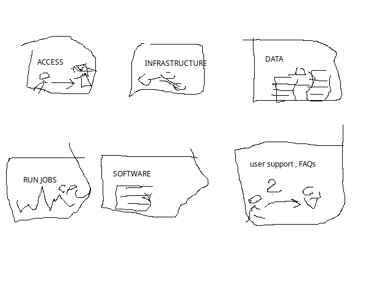
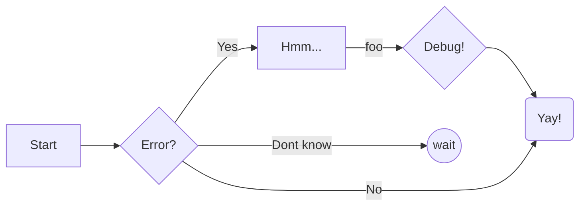
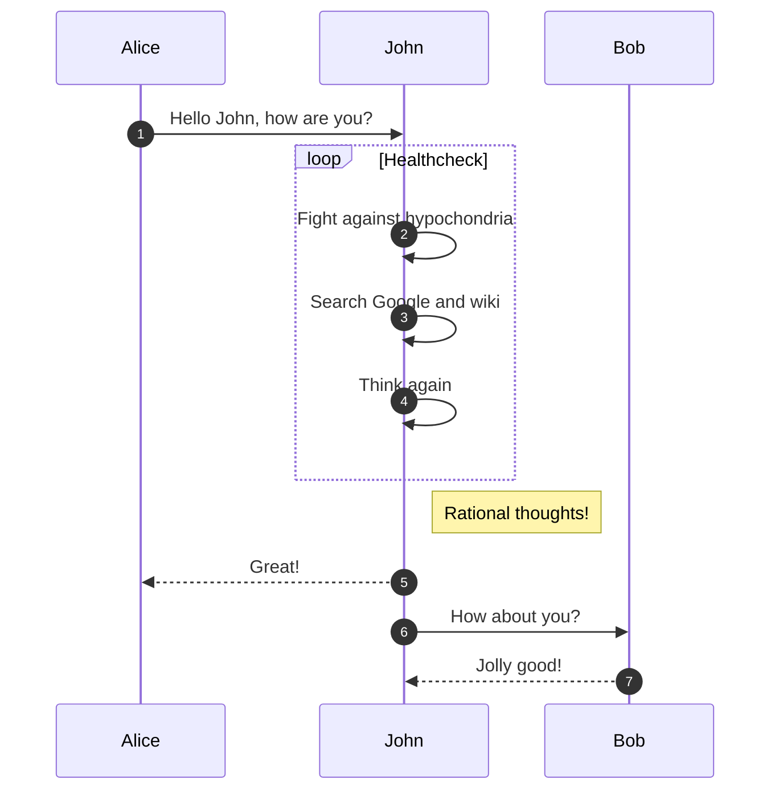
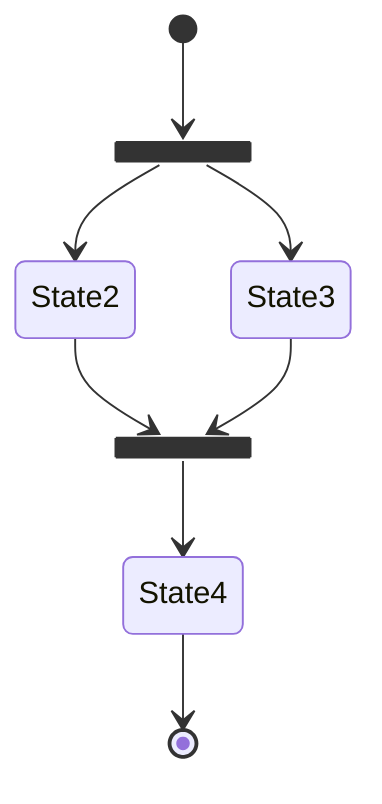
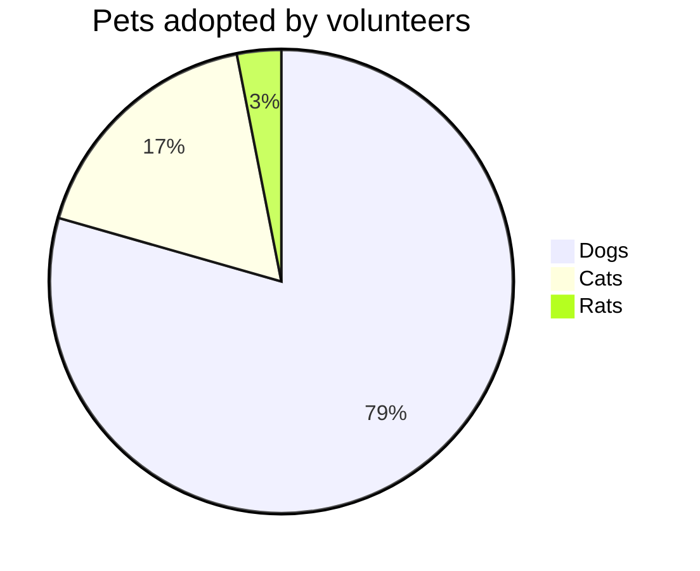
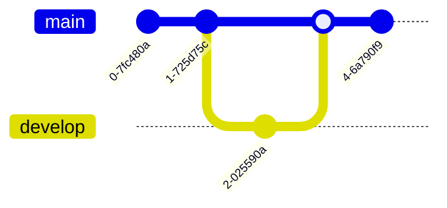
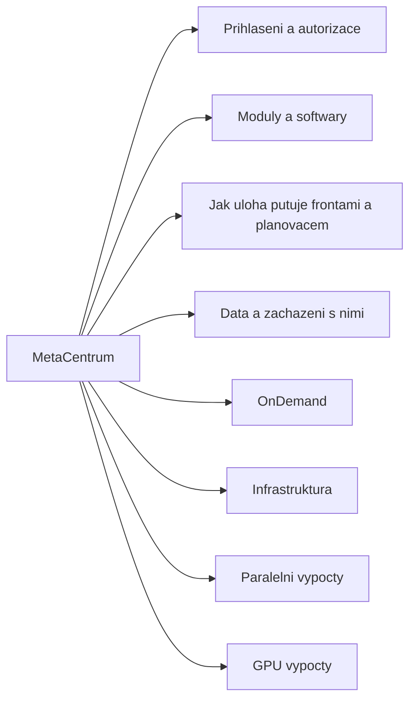

# Sandbox

## Table formatting

| title1 | title2 | title3 |
|----|----|----|
| foo | goo | hoo |
| foo | goo | hoo |
| foo | goo | hoo |
| foo | goo | hoo |
| foo | goo | hoo |

## Mermaid graphs

I need to highlight these ==very important words==.

I need to highlight these <mark>very important words</mark>.

