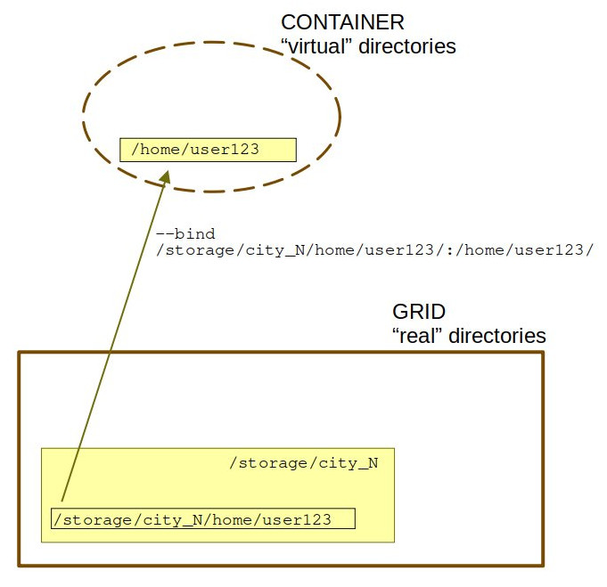

# Containers


!!! abstract "What are containers"
    *Containerization* is a software deployment process that bundles an application's code with all the files and libraries it needs to run on any infrastructure. It makes the application less dependent on the OS and system-wide installed libraries. A particular application packed together with its libraries and other files is a *container*. 

!!! abstract "Container vs image"
    An **image** is a file sitting somewhere on the disk. A **container** is a runtime instance of an image. 

[Apptainer (former Singularity)](https://docs.sylabs.io/guides/latest/user-guide) is an open-source program for containerization used in MetaCentrum.

Singularity is invoked by command `singularity`.

Singularity images (= containers) are commonly suffixed by `.sif`.

**Singularity can import Docker images without having Docker installed or being a superuser** <br/>- see [the Docker part](#docker-usage).

## Singularity usage

In the basic usecases of Singularity images covered below we suppose there already exists an image `my_image.sif` we intend to use. 

### Singularity environment variables

Singularity employs a few *paths* to store various temporary files:

- `CACHEDIR`:- downloaded layers
- `LOCALCACHEDIR`: - run shell exec
- `TMPDIR`: - squashfs and temporary files, there is limit 1GB by default, if you need more use scratch

!!! tip
    If `SCRATCHDIR` exists, Singularity **automatically** exports there variables ` SINGULARITY_TMPDIR` and `SINGULARITY_CACHEDIR`. That is why in the rest of this section the explicit export of these variables is not done.

### List options

To list all commands, run

    singularity

or

    singularity --help

on command line.

### Run a command in container

Passing a command to an Singularity image is done by `singularity exec "command"`.

For example,

    (BULLSEYE)user123@skirit:~$ singularity exec my_image.sif bash -c "java -version"
    java version "1.8.0_60"

### Open shell in container

You can also open a shell within a container to work interactively. This is done by `singularity shell` command.

For example,

    (BULLSEYE)user123@skirit:~$ singularity shell my_image.sif
    Singularity> command_1
    Singularity> command_2
    ...
    Singularity> command_N

!!! warning "Do not use frontends for serious containers' usage"
    Apart from light testing and learning, running containers right on frontends is equivalent to **computing on frontend**. This is strongly discouraged. **For a serious work with containers, use interactive or batch job.**

### Use container in interactive job

First run interative job *with scratch directory*:

    qsub -l select=1:scratch_local=10gb -l walltime=24:00:00

!!! question "What is the scratch directory good for?"
    You may need to redirect some Singularity environment variables to store temporary files. To point them to `SCRATCHDIR` is one option. Alternatively you may redirect the Singularity variables to some folder in your home.

Run the container and open a shell within the container for interactive work:

    user123@node123:~$ singularity shell my_image.sif
    Singularity> command_1
    Singularity> command_2
    ...
    Singularity> command_N

### Use container in bash job

As with any other software, it is possible to pass a batch script to a container, too.

Assume the batch script resides in `/storage/city_N/home/user123/script.sh`.

!!! question "Is the batch script for Singularity application any different from the script for "normal" application?"
    In general, no, though for a very simple script this may be the case. Most often you will at least need to redirect Singularity environment variables to `SCRATCHDIR`. The `--bind` and `bash -c` commands shown below may be hidden in the script, too.

**Variant A: put Singularity-specific option on command line**

    qsub -l select=1:scratch_local=10GB -l walltime=24:00:00 -- \
    export LOCALCACHEDIR=$SCRATCHDIR \
    singularity exec -B /storage/city_N/home/user123/script.sh:/home/user123/script.sh \
    my_image.sif bash -c "/home/user123/script.sh"

*Are you familiar with how the `-B` (or `--bind`) option in Singularity works?*

=== "Yes."

    The `-B` option binds the location of your script in the grid directory onto `/home/user123/` container directory.

=== "No."

    The `-B` option binds the location of your script in the grid directory onto `/home/user123/` container directory.

    The container sees itself as a small enclosed operating system with libraries and traditional Linux directories like `/home`, `/tmp` or `/mnt`. However this causes problem if the "real" filesystem is more complex and contains custom folders, like `/storage/city_N/home/user123`. In this case you have to specifically tell Singularity to bind these un-traditional directories.

    The `-B` option works like `"real" directory location`:`location within container`.

    Even better, `-B /home/user123:/storage/city_N/home/user123` does this:
    

Without the `-B` option, the container will automatically bind to itself host directories on computational node where the job is run and the script may not be found.

**Variant B: hide Singularity-specific option into the script**

Assume the batch script resides in `/storage/city_N/home/user123/script.sh` AND that you want to have the CLI command as simple as possible.

In this case, run batch job as 

    qsub /storage/city_N/home/user123/script.sh


The script `/storage/city_N/home/user123/script.sh` will then look somehow like the following:

```
#!/bin/bash
#PBS -N Singularity_Job
#PBS -l select=1:scratch_local=10gb
#PBS -l walltime=24:00:00

# define variables
SING_IMAGE="/path/to/my_image.sif/"
HOMEDIR=/storage/city_N/home/$USER # substitute username and path to to your real username and path

...

# test if scratch directory is set
# if scratch directory is not set, issue error message and exit
test -n "$SCRATCHDIR" || { echo >&2 "Variable SCRATCHDIR is not set!"; exit 1; }

#set SINGULARITY variables for runtime data
export SINGULARITY_CACHEDIR=$HOMEDIR
export SINGULARITY_LOCALCACHEDIR=$SCRATCHDIR

...

singularity exec --bind /storage/ \
$SING_IMAGE/my_image.sif [commands]"

...

```

## Pre-built Singularity images

MetaCentrum offers a couple of ready-to-use Singularity images (`.sif` files) together with batch scripts to run them.

These images are placed `/cvmfs/singularity.metacentrum.cz/`.

    /cvmfs/singularity.metacentrum.cz/
    │
    ├── BioBakery    
    │
    ├── Bioconductor 
    │
    ├── BioNano 
    │
    ├── Biomex  
    │
    ├── Braker 
    │
    ├── FEFLOW/
    |    # FEFLOW is a computer program for simulating groundwater flow,
    |    # mass transfer and heat transfer in porous and fractured media
    │
    ├── GATE	
    │
    ├── HybPiper 
    │
    ├── KKY/ 
    |    # KKY directory contains tools prepared specifically for
    |    # Department of Cybernetics (KKY) at University of West Bohemia in Pilsen
    │
    ├── Metacentrum 
    |    # OSs
    │
    ├── NGC/ 
    |    # NGC are GPU-tuned NVIDIA frameworks for deep learning
    |    # packed as containers,
    |    # including NAMD3, OpenCV, PyTorch, qEspresso, TensorFlow 
    │
    ├── NVIDIA_HPC_SDK/ 
    |    # an NVIDIA comprehensive suite of compilers, libraries and tools for HPC
    │
    ├── OpenFOAM/ 
    |    # OpenFOAM is a software for modelling complex fluid flows,
    |    # chemical reactions, turbulence and heat transfer, 
    |    # solid dynamics, electromagnetics and more.
    │
    ├── Peregrine/ 
    |    # Peregrine is a fast genome assembler for accurate long reads
    │
    ├── RepeatExplorer 
    │
    ├── RNApeg/ 
    |    # RNApeg is an RNA junction calling, correction, and quality-control package
    │
    ├── RStudio/ 
    |    # Integrated development environment (IDE) for R
    │
    ├── TE-Tools/ 
    |    # Dfam TE Tools is a container
    |    # that includes RepeatMasker, RepeatModeler, and coseg
    │
    ├── Trinity

## Docker usage

[Docker](https://docker.com) is just another type of container designed for single-user system that requires **root priviliges**.

For safety reasons, **running Docker images directly is not possible on Metacentrum nodes**.

If you need to use a Docker image in MetaCentrum, either

- run it in Singularity as described below, or
- use [Kubernetes service](http://docs.cerit.io/).

### Kubernetes service

[Kubernetes](http://docs.cerit.io/) is a Docker-specialized platform based on Kubernetes orchestrator.

In general, the platform can be used for almost anything, starting with a simple web application, to running a full remote desktop or a complex workflow pipeline.

### Run in Singularity

If you have an existing Docker image, you can run it without root privileges in Singularity.

If you want to change something or make your own image from scratch, you'll need root privileges; go to [Kubernetes](http://docs.cerit.io/).

**Prepare Singularity image from Docker image** as:

    singularity build image.img docker://tensorflow/tensorflow:latest

**Start docker image** as:

    qsub -l select=1 -l walltime=24:00:00 -- /usr/bin/singularity exec docker://ubuntu:latest echo "Hello Dinosaur!"

**Docker download instructions** of the type

    docker pull sangerpathogens/circlator

are in Singularity replaced as

    singularity pull docker://sangerpathogens/circlator

This command will create `circlator_latest.sif`, a singularity image of docker image. 

**Docker mounting command** of the type

    docker run -v /home/ubuntu/data:/data sangerpathogens/circlator

are in Singularity replaced by

    mkdir circ_read; singularity run -B ./circ_read/:/data ./circlator_latest.sif

where `circ_read` is folder used for getting data into image. By running the command you are in the image and using `df -h` you can check that the folder is mounted.

**For more details** see [https://www.sylabs.io/guides/3.7/user-guide/singularity\_and\_docker.html](https://www.sylabs.io/guides/3.7/user-guide/singularity_and_docker.html).

### Example

Let's say you want to run [Chronusq tool](https://urania.chem.washington.edu/chronusq/chronusq_public), an quantum chemical software package.

This is a small tool and can be compiled directly on the frontend. The resulting `.sif` image will be about 166 MB large.

Alternatively you can setup and interactive job and work from within the job.

First set path for temporary files:
(Default is `/tmp` which has quota of only 1 GB.)


    export SINGULARITY_TMPDIR=/storage/CITY_XY/home/user123/

If you work within interactive job with scratch directory, then `export SINGULARITY_TMPDIR=$SCRATCHDIR` is done automatically.

Next, download Docker image and build

    singularity pull docker://uwligroup/chronusq

After ca 5 minus the singularity image `chronusq_latest.sif` will be ready.

To test the image, download water molecule `water.inp` from [here](https://urania.chem.washington.edu/chronusq/chronusq_public/-/wikis/examples/HF-Energy) or copy from here:

```
[Molecule]
charge = 0
mult = 1
geom:
 O     0.0     -0.076    0.0
 H     0.867    0.601    0.0
 H    -0.867    0.601    0.0


[QM]
reference = Real RHF
job = SCF

[BASIS]
basis = 6-31G(d)

[MISC]
nsmp = 1
mem = 100 MB
```

and run the calculation of single-point ground state energy as

    singularity exec chronusq_latest.sif chronusq water.inp

<!--
Relevantni tickety z RT:

- [ticket](https://rt.cesnet.cz/rt/Ticket/Display.html?id=1130342)
- [ticket](https://rt.cesnet.cz/rt/Ticket/Display.html?id=1113656)
- [ticket](https://rt.cesnet.cz/rt/Ticket/Display.html?id=1084270)
-->

## Advanced options

### Custom Singularity build

Preparing your own Singularity image is intended for experienced users. Reading [Singularity documentation](https://docs.sylabs.io/guides/latest/user-guide) is a good idea too. 

To build custom image, root privileges are needed, but this can be replaced by User Namespace Remapping. For this purpose MetaCentrum offers a server `builder.metacentrum.cz` with User Namespace Remapping.

!!! warning 
    Access to `builder.metacentrum.cz` is not granted automatically. Users intending to build Singularity images have to apply for membership in group `builders` by writing a request to <meta@cesnet.cz>.

Image file is read-only and to modify it you have to use sandbox directory. In this example we use Debian Buster docker image.

    singularity build -f -s test1.sbox docker://debian:buster

After running container from sandbox, you can make changes via package system, compile the source codes, install pip/conda modules etc. In this example we install ffmpeg package in Debian Buster environment.

It is necessary to **work in the scratch directory**, using fakeroot mode (`-f` options) is not possible on storages (`/storage/cityXY/...`).

    singularity build -f -s test1.sbox docker://debian:buster

After running container from sandbox, you can make changes via package system, compile the source codes, install pip/conda modules etc. In this example we install ffmpeg package in Debian Buster environment.

    singularity shell -f -w test1.sbox
    Singularity> apt update && apt install ffmpeg
    Singularity> exit

Build image from sandbox:

    singularity build -f test1.SIF test1.sbox

For repeatable build of image you can use the definition file, example test1.def

    Bootstrap: docker
    From: debian:buster
    %post
    apt-get update && apt-get install -y ffmpeg

Build image from recipe file:

    singularity build –f test1.SIF test1.def

For more details see [https://sylabs.io/guides/3.7/user-guide/definition\_files.html](https://sylabs.io/guides/3.7/user-guide/definition_files.html).

### Singularity parallelized job

The scenario for this setup is: two nodes with common scratch dir

```
#!/bin/bash
#PBS -l select=2:ncpus=2:mem=1gb:scratch_shared=4gb
#PBS -l walltime=04:00:00
#PBS -l place=scatter
# modify/delete the above given guidelines according to your job's needs

module add openmpi-2.0.1-gcc
cat $PBS_NODEFILE |uniq >nodes.txt

# run job over ethernet or infiniband (mpirun autoselects better)
mpirun -n 2 --hostfile nodes.txt singularity exec my_image.img /path/to/program
```

