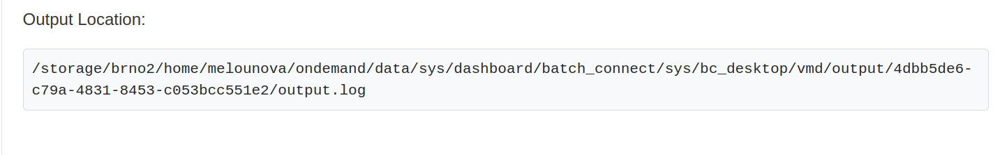
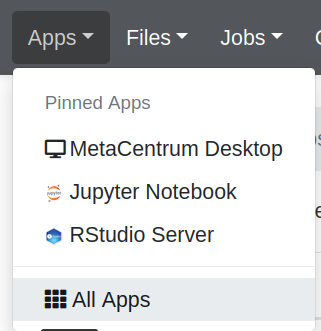

# OnDemand

[Metacentrum Open OnDemand instance](https://ondemand.metacentrum.cz) is a service that enables users to access Metacentrum via web browser.

OnDemand enables users to

- **access files** and directories using graphical File manager,
- **run graphical applications**,
- setup, modify and **run batch jobs**.

Among the pre-installed applications available are Matlab, ANSYS, Jupyter notebook and RStudio server.

!!! note "Authorization"
    Login and password to Open OnDemand web interface is your **e-INFRA CZ / Metacentrum login** and **Metacentrum password**.

Supported browsers are Google Chrome, Mozilla Firefox or Microsoft Edge. 

## Files

- **browse** Metacentrum **storages**,
- **upload/download files** from/to local PC,
- **move files** between storages,
- **edit files** on storages.

### Access to storages

In the rolldown menu, there are pre-defined shortcut links to 3 homes on different storages.

By default, the **Home Directory** link points to storage **brno2**.

!!! warning "Home Directory is fixed on brno2"
    The Home Directory for OnDemand files is currently fixed to brno2 storage. Users cannot change this setting. 

### OnDemand data directories

To store it's own files, OnDemand creates automatically directory `ondemand` in your **Home directory**. You will find there output files, error files and other data for batch jobs submitted from OnDemand interface. The subdirectories for jobs are sorted according to the apps used. 

For example, after running the VMD Desktop, all output from the session will be in `~/ondemand/data/sys/dashboard/batch_connect/sys/bc_desktop/vmd/output/ONDEMAND_SESSION_ID` directory.

!!! warning
    The **ONDEMAND_SESSION_ID** is OnDemand's internal hash for the session, not PBS job ID! It looks like e.g. `9a8b3f2b-0c6d-4cbd-922b-c587f2c2f0fb`.

You can remove the content of OnDemand data directories, or even the `~/ondemand` directory itself, any time you wish.

Every time you run OnDemand, it will first look for existing directory `~/ondemand`. When it does not find any, it creates a new one.

## Jobs

### Active jobs

Under this tab you will find list of **all running or queued jobs** on PBS server.

On the contrary to [list of interactive sessions](#my-interactive-sessions), you will see all jobs no matter whether they were submitted via OnDemand interface or otherwise.

By clicking on chosen job, you will find job's details in a similar way as in [Metavo list of your jobs](http://metavo.metacentrum.cz/pbsmon2/person). 

At the bottom of the job details table, you can get location to the output files:

### Job composer

Job composer is a GUI wizard to setup a batch job.

## Clusters

The Clusters tab is OnDemand's way to **provide CLI access** to MetaCentrum frontends. Currently there are links to:

- **zuphux** (connected with *cerit-pbs.cerit-sc.cz* PBS server),
- **skirit** (connected with *meta-pbs.metacentrum.cz* PBS server), and
- **elmo** (connected with *elixir-pbs.elixir-czech.cz* PBS server).
   

Clicking on "Shell access" will open ssh connection in your browser:

## Apps/Interactive Apps

The "Apps" tab lists all **environments**, **shell access** buttons as well as **graphical software** that can be run from the OnDemand interface.

The "Interactive Apps" tab lists **all graphical software** that is run as interactive jobs.

*Technically, `Interactive Apps` is a subset of `Apps`.*

## My Interactive Sessions

Under this tab, you will see list of your sessions running in OnDemand.

You can launch or delete running sessions. By closing the tab in the browser you will not loose your session - it can be relaunched, even on another computer, using the blue Launch button if the time reserved for the session is not up yet. 

Next to the 'Launch button is the grey *View only* (sharable link) button which is useful if you want to share live view of your desktop application with colleague.

<!--
[Current OnDemand documentation on user wiki](https://wiki.metacentrum.cz/wiki/OnDemand_v2).
-->
