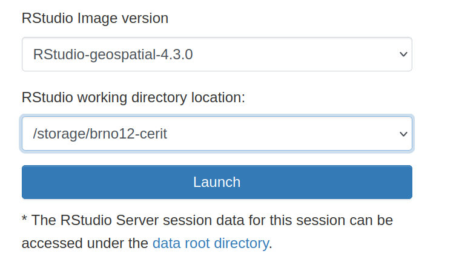

# RStudio

[RStudio](https://www.rstudio.com/) is an integrated development environment (IDE) for R. It includes a console, syntax-highlighting editor that supports direct code execution, as well as tools for plotting, history, debugging and workspace management.

## OnDemand

RStudio can be run in a browser as [OnDemand service](https://ondemand.metacentrum.cz). This is the most straighforward and simplest way.

Since the OnDemand can run on any machine, there is an option to choose custom `home` directory. This can be useful for example to have consisten version of `.Rhistory` dir, where a history of R commands is kept. 

## Kubernetes

Another option is to use [Kubernetes service](https://docs.cerit.io/), which offers [RStudio](https://docs.cerit.io/docs/rstudio.html) as

- [Rancher appliction](https://docs.cerit.io/docs/rancher.html), and
- within [Jupyter hub](https://docs.cerit.io/docs/jupyterhub.html).

