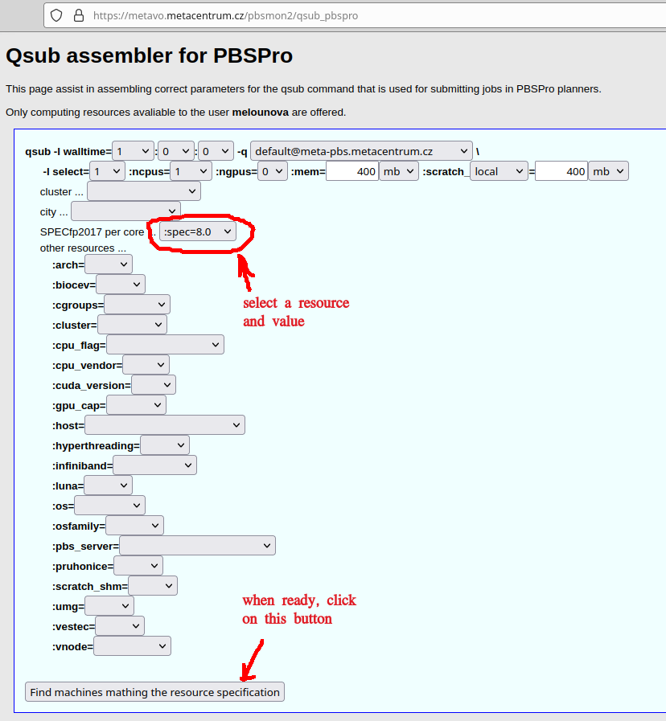

# Is there any tool to help me setup syntactically correct `qsub` command?

Yes, there exists an online tool [qsub assembler](https://metavo.metacentrum.cz/pbsmon2/qsub_pbspro).

Basically it is a form with a drop-down menu for every PBS resource type.

The only thing you need to do is to setup the value of selected resource(s) and click on the "Find machines" button.

As a result you will get

- a `qsub` command in a single-line format (to paste on CLI)
- dtto in a multi-line format of `#PBS` directives (to paste to the top section of batch script)
- a list of machines that comply with your criterions

The common confusion is that users try to remove the whole scratch directory

    rm -rf $SCRATCHDIR

while they are allowed to remove only the *content* of the scratch directory:

    rm -rf $SCRATCHDIR/*

The empty scratch directory will be removed automatically after some time.
